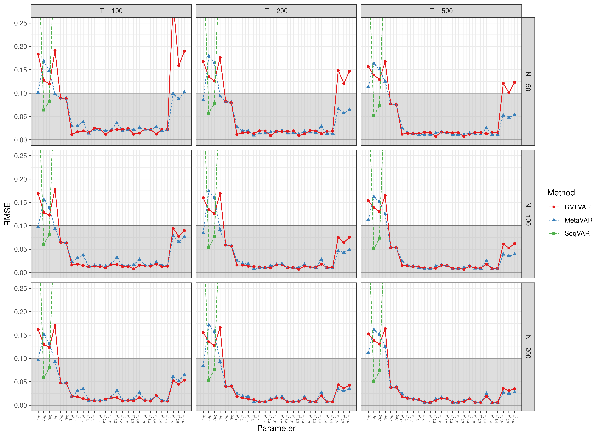
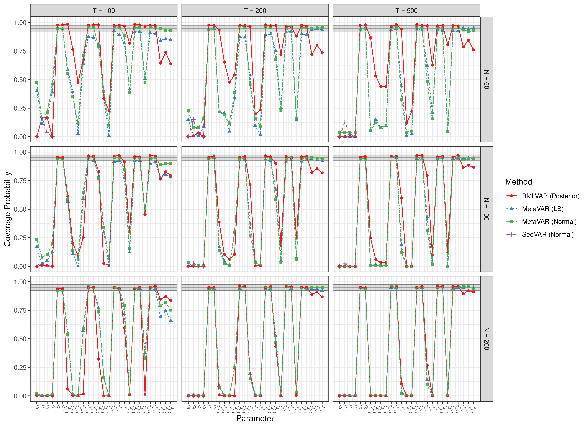

# Scatter Plots - Escalating Co-Activation

``` r

library(manMetaVAR)
```

``` r

data(results, package = "manMetaVAR")
```

### Bias


### RMSE



### Coverage Probabilities



### Statistical Power


### Type 1 Error


