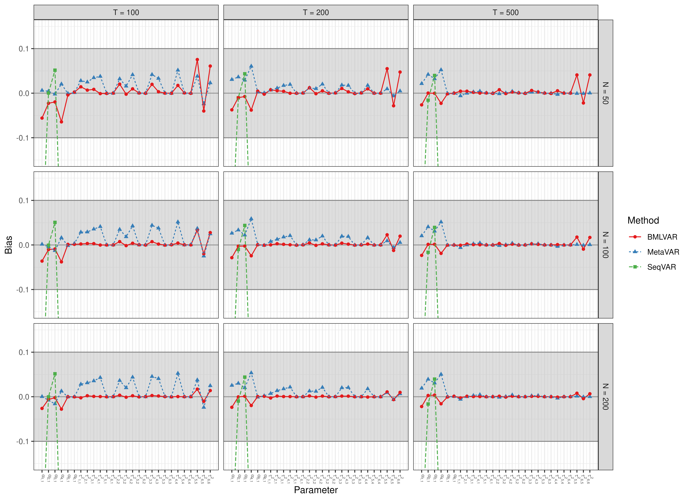
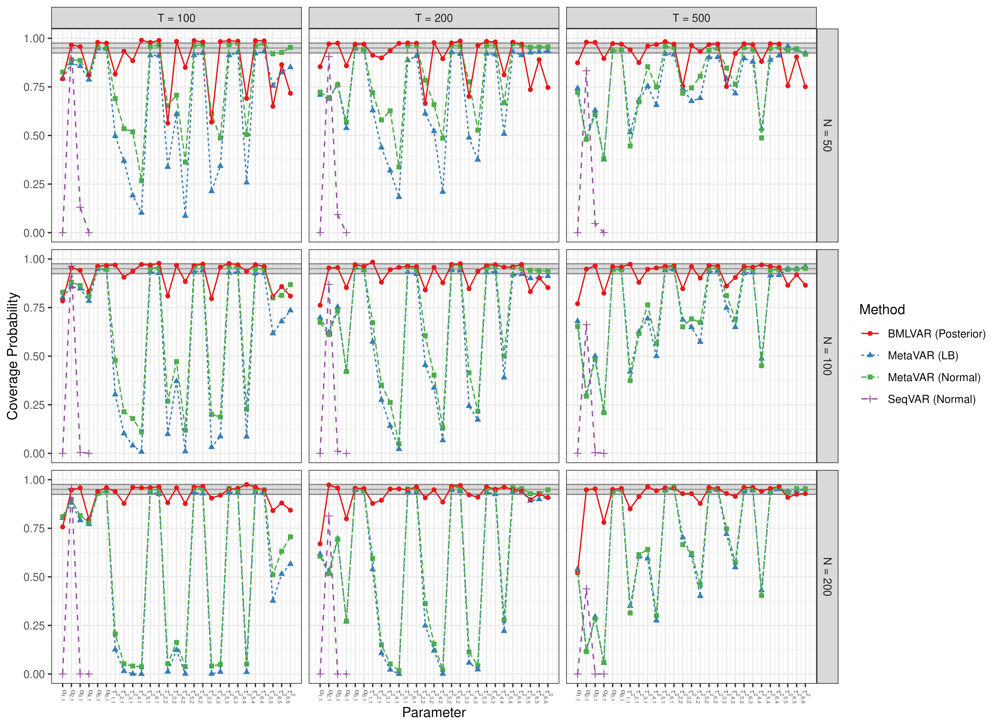
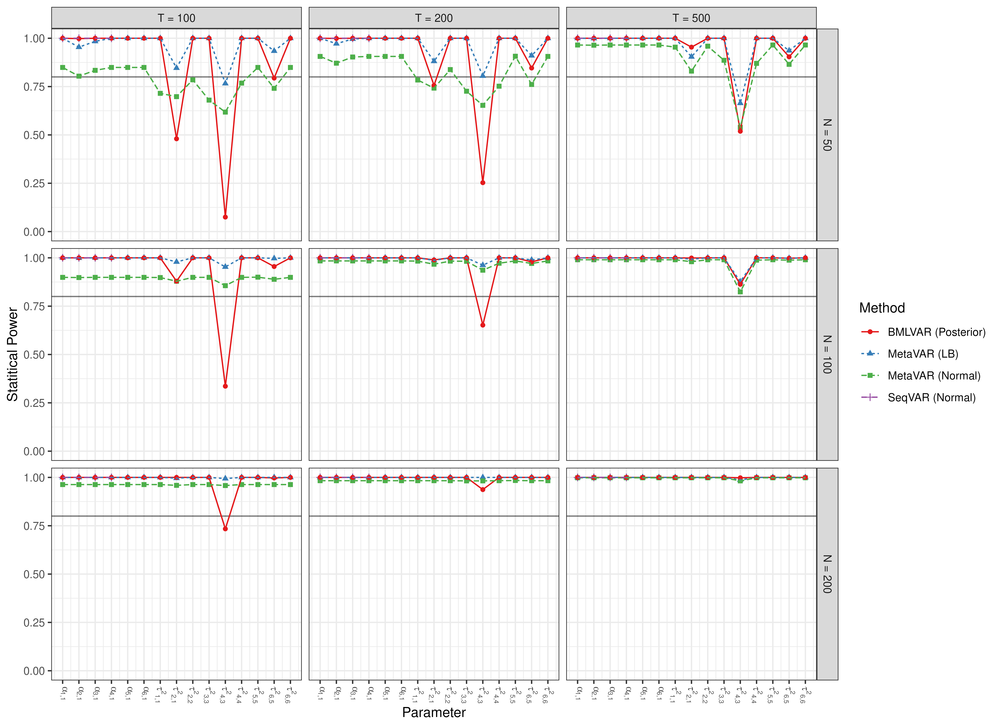

# Scatter Plots - Stable Reciprocal Regulation

``` r

library(manMetaVAR)
```

``` r

data(results, package = "manMetaVAR")
```

### Bias



### RMSE


### Coverage Probabilities



### Statistical Power



### Type 1 Error


