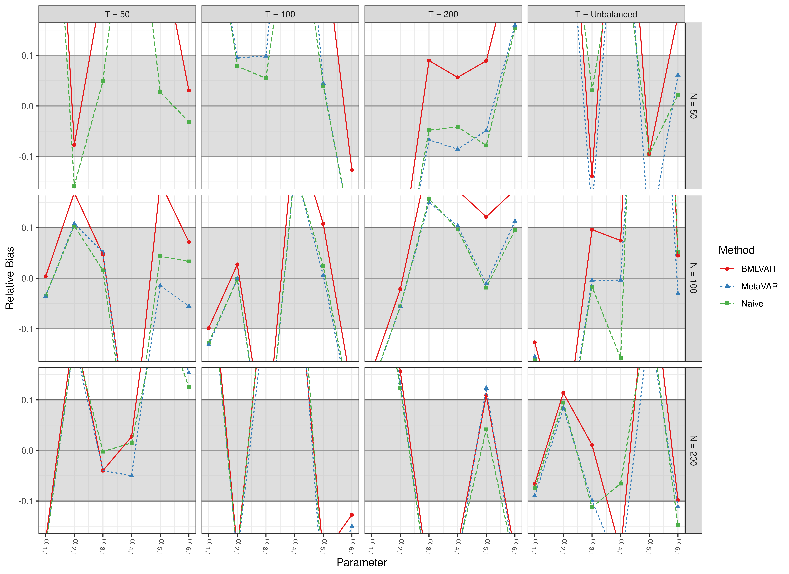
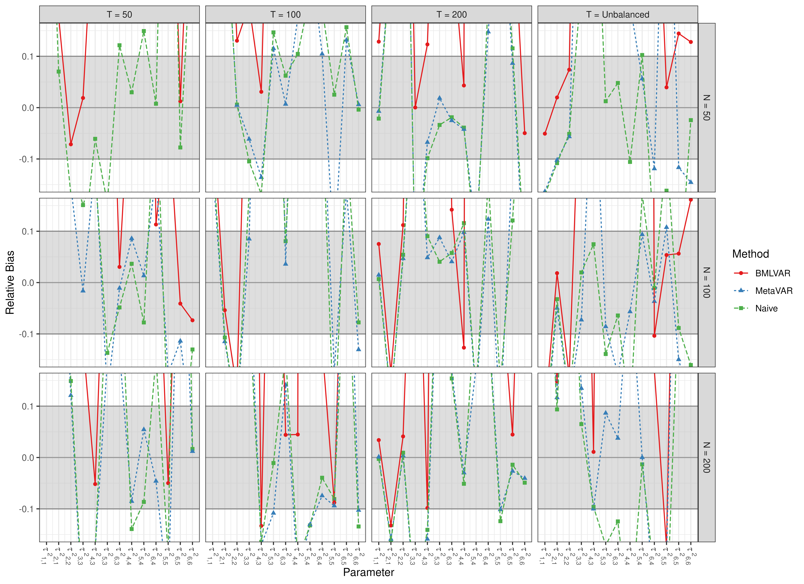
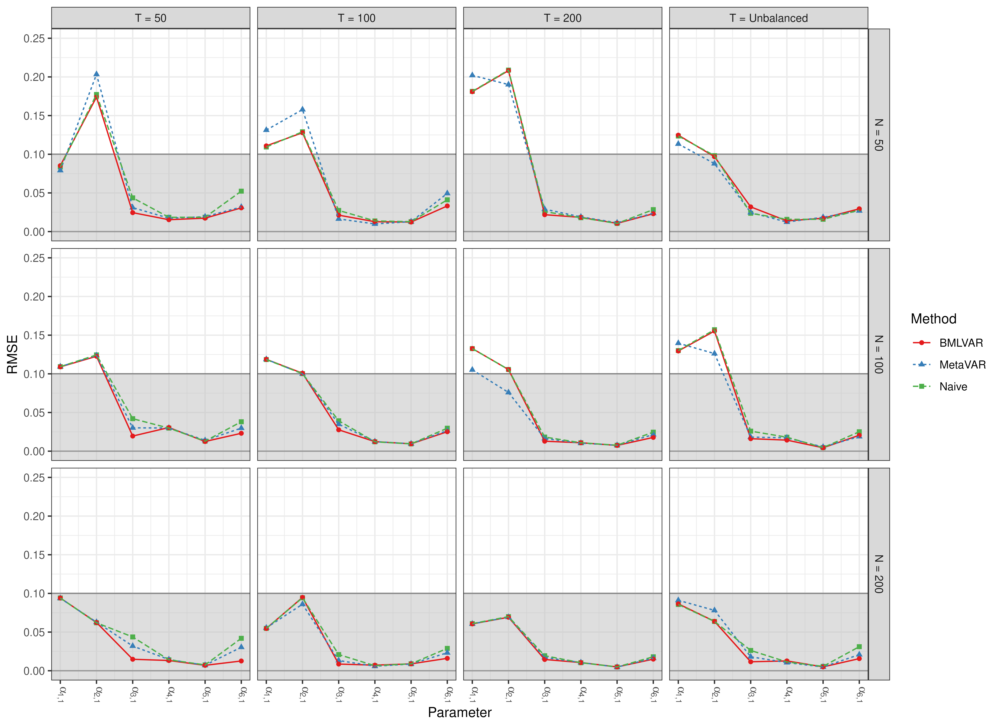
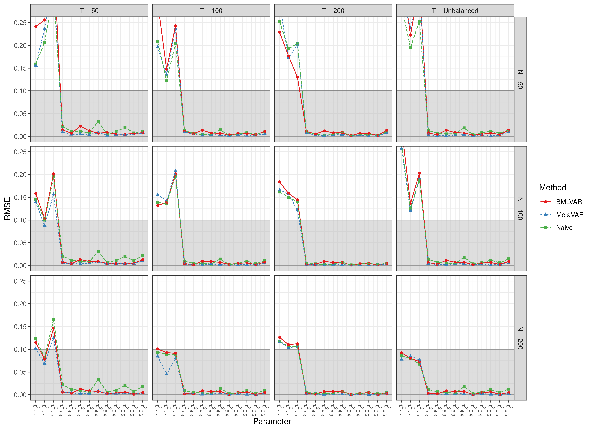
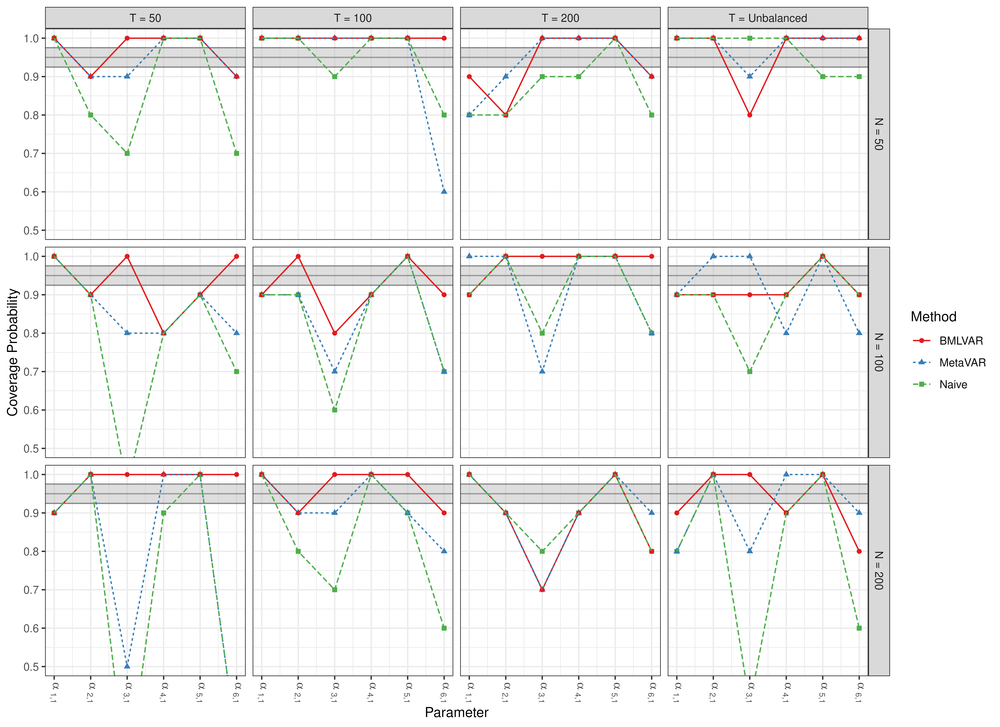
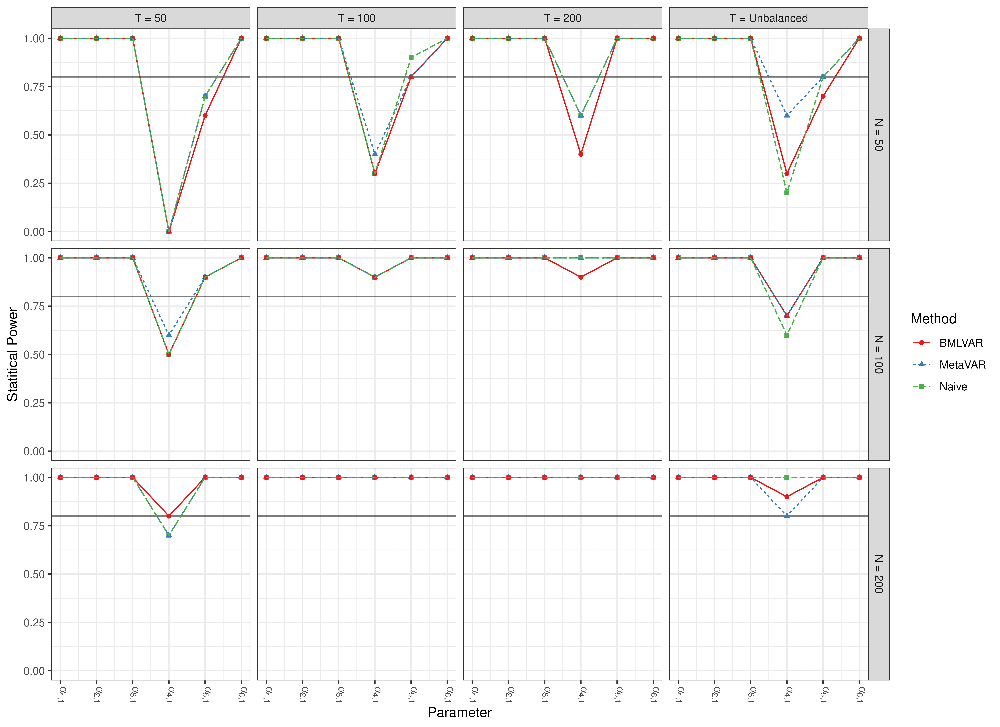

# Scatter Plots

``` r

library(manMetaVAR)
```

``` r

data(results, package = "manMetaVAR")
```

### Bias

#### Fixed Effects

##### Point Estimates


##### Standard Errors



#### Random Effects

##### Point Estimates


##### Standard Errors



### RMSE

#### Fixed Effects



#### Random Effects



### Coverage Probabilities

#### Fixed Effects



#### Random Effects


### Statistical Power

#### Fixed Effects



#### Random Effects


