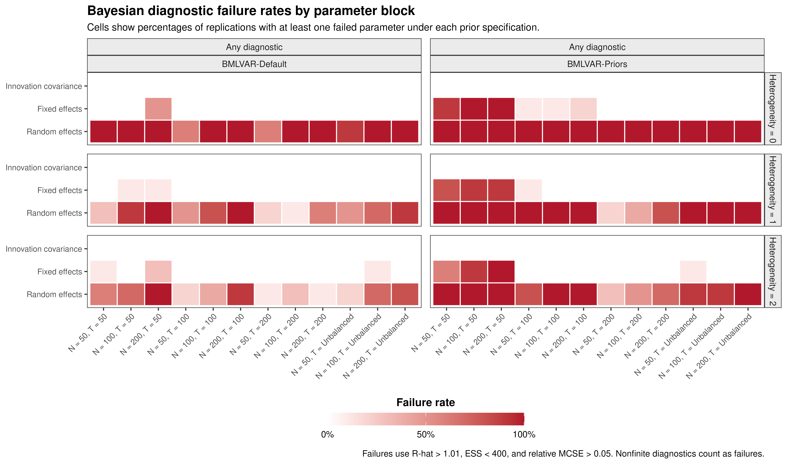
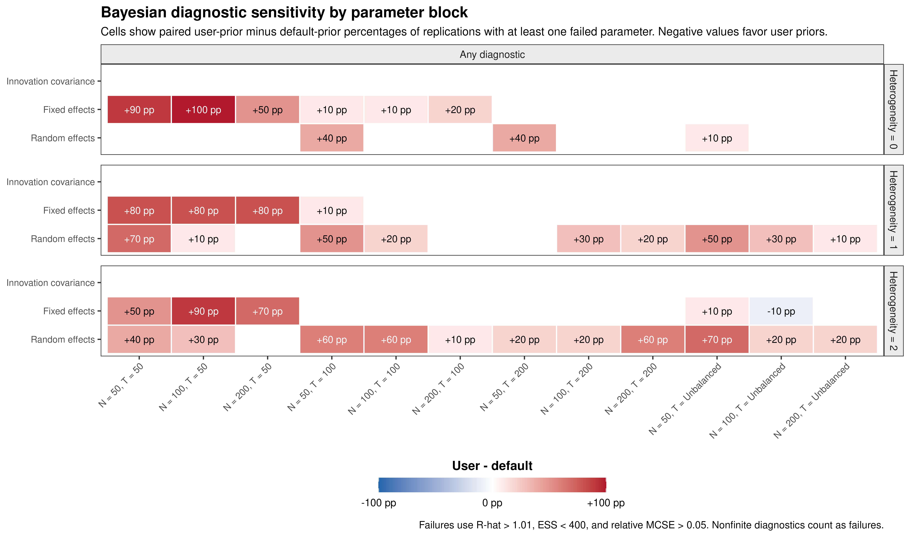
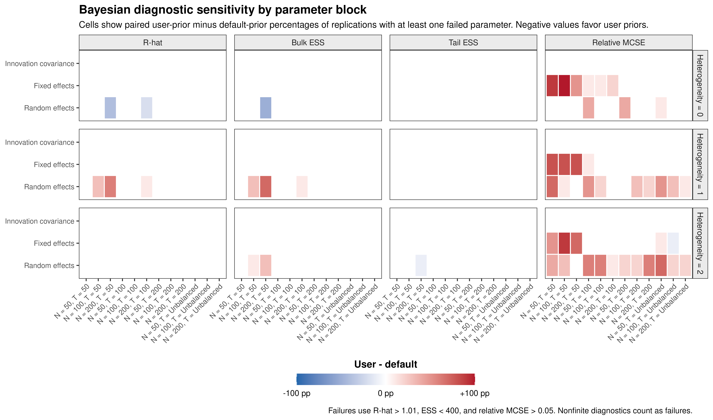
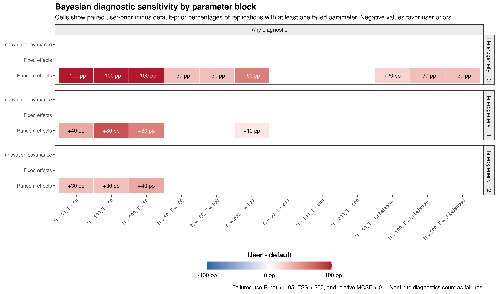

# Bayesian (Mplus) Diagnostics

## Overview

The Bayesian simulation conditions were estimated in Mplus using the
default prior specification and the user-specified prior specification.
The figures below summarize convergence and Monte Carlo performance
across all simulation task IDs.

For the primary summaries, a replication is classified as having a
diagnostic failure within a parameter block when at least one parameter
in that block fails the requested criterion. The three parameter blocks
are the innovation covariance parameters, fixed effects, and random
effects. This block-level summary is more compact than displaying every
parameter in the main figure.

The default diagnostic thresholds are R-hat greater than 1.01, bulk or
tail effective sample size less than 400, and relative Monte Carlo
standard error greater than 0.05. Nonfinite diagnostics are classified
as failures.

## Overall diagnostic failure rates

### Default and user-specified priors



### Prior sensitivity

The following figure reports the paired difference in failure rates:

``` math
\text{user-specified priors} - \text{default priors}.
```

Negative values indicate fewer failures under the user-specified priors,
whereas positive values indicate more failures.



### Simulation-case sensitivity table

The block-level figure emphasizes broad patterns. The following table
retains each simulation case separately and reports the paired
user-prior minus default-prior difference in the percentage of
replications with at least one failed parameter in each block. Positive
values indicate more failures under the user-specified priors, whereas
negative values indicate fewer failures.

| Task ID | Heterogeneity | N | T | Innovation covariance | Fixed effects | Random effects |
|---:|---:|---:|:---|---:|---:|---:|
| 1 | 1 | 50 | 50 | 0 pp | +80 pp | +70 pp |
| 2 | 1 | 100 | 50 | 0 pp | +80 pp | +10 pp |
| 3 | 1 | 200 | 50 | 0 pp | +80 pp | 0 pp |
| 4 | 1 | 50 | 100 | 0 pp | +10 pp | +50 pp |
| 5 | 1 | 100 | 100 | 0 pp | 0 pp | +20 pp |
| 6 | 1 | 200 | 100 | 0 pp | 0 pp | 0 pp |
| 7 | 1 | 50 | 200 | 0 pp | 0 pp | 0 pp |
| 8 | 1 | 100 | 200 | 0 pp | 0 pp | +30 pp |
| 9 | 1 | 200 | 200 | 0 pp | 0 pp | +20 pp |
| 10 | 1 | 50 | Unbalanced | 0 pp | 0 pp | +50 pp |
| 11 | 1 | 100 | Unbalanced | 0 pp | 0 pp | +30 pp |
| 12 | 1 | 200 | Unbalanced | 0 pp | 0 pp | +10 pp |
| 13 | 2 | 50 | 50 | 0 pp | +50 pp | +40 pp |
| 14 | 2 | 100 | 50 | 0 pp | +90 pp | +30 pp |
| 15 | 2 | 200 | 50 | 0 pp | +70 pp | 0 pp |
| 16 | 2 | 50 | 100 | 0 pp | 0 pp | +60 pp |
| 17 | 2 | 100 | 100 | 0 pp | 0 pp | +60 pp |
| 18 | 2 | 200 | 100 | 0 pp | 0 pp | +10 pp |
| 19 | 2 | 50 | 200 | 0 pp | 0 pp | +20 pp |
| 20 | 2 | 100 | 200 | 0 pp | 0 pp | +20 pp |
| 21 | 2 | 200 | 200 | 0 pp | 0 pp | +60 pp |
| 22 | 2 | 50 | Unbalanced | 0 pp | +10 pp | +70 pp |
| 23 | 2 | 100 | Unbalanced | 0 pp | -10 pp | +20 pp |
| 24 | 2 | 200 | Unbalanced | 0 pp | 0 pp | +20 pp |
| 25 | 0 | 50 | 50 | 0 pp | +90 pp | 0 pp |
| 26 | 0 | 100 | 50 | 0 pp | +100 pp | 0 pp |
| 27 | 0 | 200 | 50 | 0 pp | +50 pp | 0 pp |
| 28 | 0 | 50 | 100 | 0 pp | +10 pp | +40 pp |
| 29 | 0 | 100 | 100 | 0 pp | +10 pp | 0 pp |
| 30 | 0 | 200 | 100 | 0 pp | +20 pp | 0 pp |
| 31 | 0 | 50 | 200 | 0 pp | 0 pp | +40 pp |
| 32 | 0 | 100 | 200 | 0 pp | 0 pp | 0 pp |
| 33 | 0 | 200 | 200 | 0 pp | 0 pp | 0 pp |
| 34 | 0 | 50 | Unbalanced | 0 pp | 0 pp | +10 pp |
| 35 | 0 | 100 | Unbalanced | 0 pp | 0 pp | 0 pp |
| 36 | 0 | 200 | Unbalanced | 0 pp | 0 pp | 0 pp |

Paired user-prior minus default-prior diagnostic failure-rate
differences for each simulation case. {.table style="width:100%;"}

## Sources of diagnostic failure

The next figure separates failures attributable to R-hat, bulk effective
sample size, tail effective sample size, and relative Monte Carlo
standard error. Cell labels are omitted to emphasize the overall
pattern.



## Alternative diagnostic thresholds

A compact threshold-sensitivity analysis can be produced by changing the
criteria while retaining the same block-level summary. The example below
uses R-hat greater than 1.05, effective sample size less than 200, and
relative Monte Carlo standard error greater than 0.10.



## Parameter-level follow-up figures

The block-level overview is intended for the manuscript or response to
reviewers. Parameter-level heatmaps can be used as supplementary
drill-down figures when a block shows meaningful diagnostic sensitivity.
To keep these figures legible, display one parameter family at a time
and omit cell labels.

\
`fixed_effect_parameters`` ``<-`` `[`c`](https://rdrr.io/r/base/c.html)`(`\
`  ``"mean(beta[1,1])"``,`\
`  ``"mean(beta[2,1])"``,`\
`  ``"mean(beta[1,2])"``,`\
`  ``"mean(beta[2,2])"``,`\
`  ``"mean(mu[1,1])"``,`\
`  ``"mean(mu[2,1])"`\
`)`\
\
[`FigMplusDiagnosticsHeatmap`](https://github.com/jeksterslab/manMetaVAR/reference/FigMplusDiagnosticsHeatmap.md)`(`\
`  diagnostics ``=`` ``diagnostics``,`\
`  metric_name ``=`` ``"failure_rate"``,`\
`  comparison ``=`` ``"difference"``,`\
`  diagnostic ``=`` ``"Any diagnostic"``,`\
`  parm ``=`` ``fixed_effect_parameters``,`\
`  values ``=`` ``FALSE`\
`)`

Raw R-hat, effective sample size, and Monte Carlo standard-error
differences are generally less interpretable as primary figures because
they use very different numerical scales. Threshold-based failure rates
provide a common and directly interpretable sensitivity metric. The
continuous diagnostics can still be inspected for selected parameters
when needed.

## Extracting plotted summaries

Each figure retains the values used to construct the heatmap. These
summaries can be used for manuscript tables or reviewer-response text.

    #>   taskid           method   n time heterogeneity     target     diagnostic
    #> 1      1 Priors - Default  50   50             1         FE Any diagnostic
    #> 2      1 Priors - Default  50   50             1 Innovation Any diagnostic
    #> 3      1 Priors - Default  50   50             1         RE Any diagnostic
    #> 4      2 Priors - Default 100   50             1         FE Any diagnostic
    #> 5      2 Priors - Default 100   50             1 Innovation Any diagnostic
    #> 6      2 Priors - Default 100   50             1         RE Any diagnostic
    #>   value n_valid comparison        unit condition_label heterogeneity_label
    #> 1   0.8      10 difference replication  N = 50, T = 50   Heterogeneity = 1
    #> 2   0.0      10 difference replication  N = 50, T = 50   Heterogeneity = 1
    #> 3   0.7      10 difference replication  N = 50, T = 50   Heterogeneity = 1
    #> 4   0.8      10 difference replication N = 100, T = 50   Heterogeneity = 1
    #> 5   0.0      10 difference replication N = 100, T = 50   Heterogeneity = 1
    #> 6   0.1      10 difference replication N = 100, T = 50   Heterogeneity = 1
    #>            target_label diagnostic_panel fill_value value_label text_colour
    #> 1         Fixed effects   Any diagnostic        0.8      +80 pp       white
    #> 2 Innovation covariance   Any diagnostic        0.0        <NA>       black
    #> 3        Random effects   Any diagnostic        0.7      +70 pp       white
    #> 4         Fixed effects   Any diagnostic        0.8      +80 pp       white
    #> 5 Innovation covariance   Any diagnostic        0.0        <NA>       black
    #> 6        Random effects   Any diagnostic        0.1      +10 pp       black
