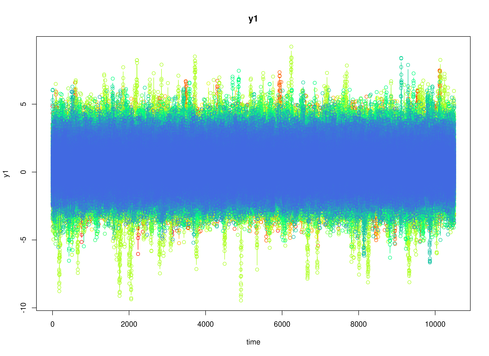
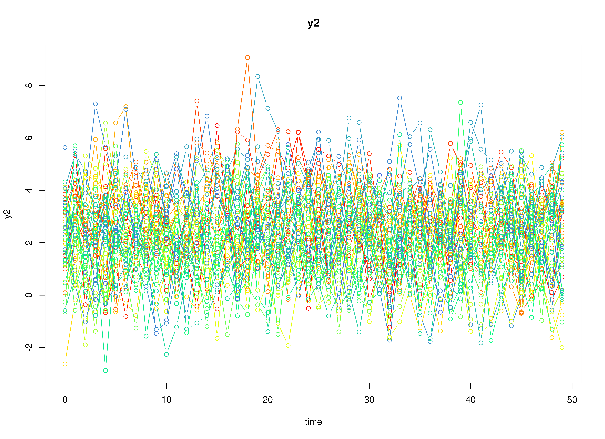

# Single Replication from the Simulation Study

``` r

library(OpenMx)
library(fitVARMxID)
library(metaDyn)
library(manMetaVAR)
```

## Data Generation

``` r

taskid <- 10
seed <- 42
set.seed(seed)
data <- GenData(
  taskid = taskid,
  seed = seed
)
```

``` r

plot(data)
```



``` r

summary(data)
#>        id             time              y1               y2        
#>  Min.   : 1.00   Min.   :  0.00   Min.   :-3.247   Min.   :-4.140  
#>  1st Qu.:13.00   1st Qu.: 28.00   1st Qu.: 1.798   1st Qu.: 1.060  
#>  Median :26.00   Median : 61.00   Median : 2.941   Median : 2.191  
#>  Mean   :25.57   Mean   : 73.63   Mean   : 2.890   Mean   : 2.175  
#>  3rd Qu.:38.00   3rd Qu.:110.00   3rd Qu.: 3.988   3rd Qu.: 3.250  
#>  Max.   :50.00   Max.   :199.00   Max.   : 9.199   Max.   : 8.406
```

## MetaVAR

``` r

dtvar <- FitDTVAR(
  data = data,
  seed = seed
)
```

``` r

summary(dtvar, means = TRUE)
#> Call:
#> FitVARMxID(data = data$data, observed = paste0("y", seq_len(model$k)), 
#>     id = "id", time = NULL, ct = FALSE, center = TRUE, mu_fixed = FALSE, 
#>     mu_free = NULL, mu_values = data$mu, mu_lbound = NULL, mu_ubound = NULL, 
#>     alpha_fixed = FALSE, alpha_free = NULL, alpha_values = NULL, 
#>     alpha_lbound = NULL, alpha_ubound = NULL, beta_fixed = FALSE, 
#>     beta_free = NULL, beta_values = data$beta, beta_lbound = NULL, 
#>     beta_ubound = NULL, psi_diag = FALSE, psi_fixed = FALSE, 
#>     psi_d_free = NULL, psi_d_values = model$psi_d_ldl, psi_d_lbound = NULL, 
#>     psi_d_ubound = NULL, psi_d_equal = FALSE, psi_l_free = NULL, 
#>     psi_l_values = model$psi_l_ldl, psi_l_lbound = NULL, psi_l_ubound = NULL, 
#>     nu_fixed = TRUE, nu_free = NULL, nu_values = NULL, nu_lbound = NULL, 
#>     nu_ubound = NULL, theta_diag = TRUE, theta_fixed = TRUE, 
#>     theta_d_free = NULL, theta_d_values = NULL, theta_d_lbound = NULL, 
#>     theta_d_ubound = NULL, theta_d_equal = FALSE, theta_l_free = NULL, 
#>     theta_l_values = NULL, theta_l_lbound = NULL, theta_l_ubound = NULL, 
#>     mu0_fixed = TRUE, mu0_func = TRUE, mu0_free = NULL, mu0_values = NULL, 
#>     mu0_lbound = NULL, mu0_ubound = NULL, sigma0_fixed = TRUE, 
#>     sigma0_func = TRUE, sigma0_diag = FALSE, sigma0_d_free = NULL, 
#>     sigma0_d_values = NULL, sigma0_d_lbound = NULL, sigma0_d_ubound = NULL, 
#>     sigma0_d_equal = FALSE, sigma0_l_free = NULL, sigma0_l_values = NULL, 
#>     sigma0_l_lbound = NULL, sigma0_l_ubound = NULL, robust = FALSE, 
#>     seed = seed, silent = TRUE, ncores = ncores)
#> 
#> Convergence:
#> 100.0%
#> 
#> Means of the estimated paramaters per individual.
#>   mu[1,1]   mu[2,1] beta[1,1] beta[2,1] beta[1,2] beta[2,2]  psi[1,1]  psi[2,1] 
#>    2.8930    2.3276    0.2549   -0.0486   -0.0590    0.2070    1.2448    0.5272 
#>  psi[2,2] 
#>    1.4661
```

``` r

metavar <- FitMetaVAR(
  fit = dtvar,
  seed = seed
)
```

``` r

summary(metavar)
#> Call:
#> MetaVARMx(object = fit$output, x = NULL, random = TRUE, alpha_values = model$ma_fixed, 
#>     tau_sqr_diag = FALSE, tau_sqr_d_free = TRUE, tau_sqr_d_values = model$ma_random_d_ldl, 
#>     tau_sqr_l_free = matrix(data = c(FALSE, FALSE, FALSE, FALSE, 
#>         FALSE, FALSE, TRUE, FALSE, FALSE, FALSE, FALSE, FALSE, 
#>         FALSE, FALSE, FALSE, FALSE, FALSE, FALSE, FALSE, FALSE, 
#>         TRUE, FALSE, FALSE, FALSE, FALSE, FALSE, TRUE, TRUE, 
#>         FALSE, FALSE, FALSE, FALSE, TRUE, TRUE, TRUE, FALSE), 
#>         byrow = TRUE, nrow = 6, ncol = 6), tau_sqr_l_values = model$ma_random_l_ldl, 
#>     effects = TRUE, set_point = TRUE, int_meas = FALSE, int_dyn = FALSE, 
#>     cov_meas = FALSE, cov_dyn = FALSE, robust_v = FALSE, robust = FALSE, 
#>     seed = seed, silent = TRUE, ncores = ncores)
#> 
#> Status code:
#> 0
#> 
#> CI type:
#> "normal"
#> 
#>                  est     se        z      p    2.5%   97.5%
#> alpha[1,1]    2.8951 0.1661  17.4252 0.0000  2.5695  3.2208
#> alpha[2,1]    2.3329 0.1456  16.0172 0.0000  2.0474  2.6183
#> alpha[3,1]    0.2561 0.0225  11.3805 0.0000  0.2120  0.3002
#> alpha[4,1]   -0.0658 0.0212  -3.0991 0.0019 -0.1074 -0.0242
#> alpha[5,1]   -0.0532 0.0140  -3.8035 0.0001 -0.0806 -0.0258
#> alpha[6,1]    0.2211 0.0290   7.6128 0.0000  0.1642  0.2780
#> tau_sqr[1,1]  1.3523 0.2765   4.8905 0.0000  0.8103  1.8943
#> tau_sqr[2,1]  0.5742 0.1902   3.0189 0.0025  0.2014  0.9470
#> tau_sqr[2,2]  1.0252 0.2126   4.8216 0.0000  0.6085  1.4420
#> tau_sqr[3,3]  0.0146 0.0049   2.9567 0.0031  0.0049  0.0243
#> tau_sqr[4,3]  0.0067 0.0036   1.8437 0.0652 -0.0004  0.0138
#> tau_sqr[5,3] -0.0009 0.0024  -0.3728 0.7093 -0.0056  0.0038
#> tau_sqr[6,3]  0.0104 0.0048   2.1576 0.0310  0.0010  0.0199
#> tau_sqr[4,4]  0.0101 0.0043   2.3442 0.0191  0.0017  0.0186
#> tau_sqr[5,4]  0.0012 0.0020   0.5972 0.5504 -0.0027  0.0050
#> tau_sqr[6,4]  0.0030 0.0043   0.7114 0.4768 -0.0053  0.0114
#> tau_sqr[5,5]  0.0016 0.0022   0.7533 0.4513 -0.0026  0.0059
#> tau_sqr[6,5]  0.0003 0.0029   0.0994 0.9208 -0.0054  0.0060
#> tau_sqr[6,6]  0.0311 0.0083   3.7352 0.0002  0.0148  0.0475
#> i_sqr[1,1]    0.9876 0.0025 393.4421 0.0000  0.9827  0.9925
#> i_sqr[2,1]    0.9804 0.0040 245.9482 0.0000  0.9726  0.9883
#> i_sqr[3,1]    0.6171 0.0799   7.7224 0.0000  0.4605  0.7737
#> i_sqr[4,1]    0.4403 0.1131   3.8912 0.0001  0.2185  0.6620
#> i_sqr[5,1]    0.2825 0.1511   1.8696 0.0615 -0.0137  0.5786
#> i_sqr[6,1]    0.8221 0.0372  22.1172 0.0000  0.7493  0.8950
```

## Mplus

``` r

mplus <- FitMplus(
  data = data,
  seed = seed
)
```

``` r

summary(mplus)
#> Error in `utils::read.table()`:
#> ! no lines available in input
```

``` r

coef(mplus)
#> Error in `utils::read.table()`:
#> ! no lines available in input
```

``` r

vcov(mplus)
#> Error in `utils::read.table()`:
#> ! no lines available in input
```

### Posterior Distributions

``` r

plot(mplus, what = "posterior")
#> Error in `utils::read.table()`:
#> ! no lines available in input
```

### Trace Plots

``` r

plot(mplus, what = "trace")
#> Error in `utils::read.table()`:
#> ! no lines available in input
```

### Mplus Output

    Mplus VERSION 9 DEMO (Linux)
    MUTHEN & MUTHEN
    03/15/2026   6:25 PM

    INPUT INSTRUCTIONS

          TITLE:
            Multilevel Vector Autoregressive Model
          DATA:
            FILE = mplus_cOyAJKESetHBNc5GPxDQ_data.dat;
          VARIABLE:
            NAMES = ID TIME Y1 Y2;
            USEVARIABLES = Y1 Y2;
            CLUSTER = ID;
            LAGGED = Y1(1) Y2(1);
          ANALYSIS:
            TYPE = TWOLEVEL RANDOM;
            ESTIMATOR = BAYES;
            CHAINS = 2;
            FBITER = (40000);
            PROCESSORS = 1;
            BSEED = 42;
          MODEL:
            %WITHIN%
              ! transition matrix (beta)
              BETA11 | Y1 ON Y1&1;
              BETA21 | Y2 ON Y1&1;
              BETA12 | Y1 ON Y2&1;
              BETA22 | Y2 ON Y2&1;
              ! process noise covariance matrix (psi)
              Y1;
              Y2 WITH Y1;
              Y2;
            %BETWEEN%
              ! person-specific means (mu)
              [Y1];
              [Y2];
              Y1;
              Y2 WITH Y1;
              Y2;
              ! person-specific lagged effects (beta)
              [BETA11];
              [BETA21];
              [BETA12];
              [BETA22];
              BETA11;
              BETA21 WITH BETA11;
              BETA12 WITH BETA11;
              BETA22 WITH BETA11;
              BETA21;
              BETA12 WITH BETA21;
              BETA22 WITH BETA21;
              BETA12;
              BETA22 WITH BETA12;
              BETA22;
          OUTPUT:
            TECH1 TECH8;
          SAVEDATA:
            BPARAMETERS = mplus_cOyAJKESetHBNc5GPxDQ_posterior.dat;


    DEMO VERSION MAXIMUM EXCEEDED
      Maximum number of continuous latent variables has been exceeded.
      Number of continuous latent variables in the model: 4


    Mplus VERSION 9 DEMO (Linux) has the following limitations:
      Maximum number of dependent variables: 6
      Maximum number of independent variables: 2
      Maximum number of between variables: 2
      Maximum number of continuous latent variables in time series analysis: 2


    MUTHEN & MUTHEN
    3463 Stoner Ave.
    Los Angeles, CA  90066

    Tel: (310) 391-9971
    Fax: (310) 391-8971
    Web: www.StatModel.com
    Support: Support@StatModel.com

    Copyright (c) 1998-2025 Muthen & Muthen

## Naive

``` r

naive <- FitNaive(
  fit = dtvar
)
```

``` r

summary(naive)
#>                  est     se       z      p    2.5%   97.5%
#> alpha[1,1]    2.8930 0.1661 17.4205 0.0000  2.5675  3.2185
#> alpha[2,1]    2.3276 0.1459 15.9498 0.0000  2.0415  2.6136
#> alpha[3,1]    0.2549 0.0236 10.8153 0.0000  0.2087  0.3011
#> alpha[4,1]   -0.0486 0.0229 -2.1223 0.0338 -0.0934 -0.0037
#> alpha[5,1]   -0.0590 0.0183 -3.2270 0.0013 -0.0949 -0.0232
#> alpha[6,1]    0.2070 0.0289  7.1559 0.0000  0.1503  0.2637
#> tau_sqr[1,1]  1.3790 0.2758  5.0000 0.0000  0.8384  1.9195
#> tau_sqr[2,1]  0.5931 0.1908  3.1085 0.0019  0.2191  0.9670
#> tau_sqr[2,2]  1.0648 0.2130  5.0000 0.0000  0.6474  1.4822
#> tau_sqr[3,3]  0.0278 0.0056  5.0000 0.0000  0.0169  0.0387
#> tau_sqr[4,3]  0.0135 0.0043  3.1569 0.0016  0.0051  0.0218
#> tau_sqr[5,3] -0.0079 0.0032 -2.4412 0.0146 -0.0143 -0.0016
#> tau_sqr[6,3]  0.0073 0.0049  1.4764 0.1398 -0.0024  0.0169
#> tau_sqr[4,4]  0.0262 0.0052  5.0000 0.0000  0.0159  0.0364
#> tau_sqr[5,4] -0.0030 0.0030 -1.0144 0.3104 -0.0089  0.0028
#> tau_sqr[6,4] -0.0022 0.0047 -0.4686 0.6393 -0.0114  0.0070
#> tau_sqr[5,5]  0.0167 0.0033  5.0000 0.0000  0.0102  0.0233
#> tau_sqr[6,5]  0.0046 0.0038  1.2097 0.2264 -0.0028  0.0120
#> tau_sqr[6,6]  0.0418 0.0084  5.0000 0.0000  0.0254  0.0582
```
