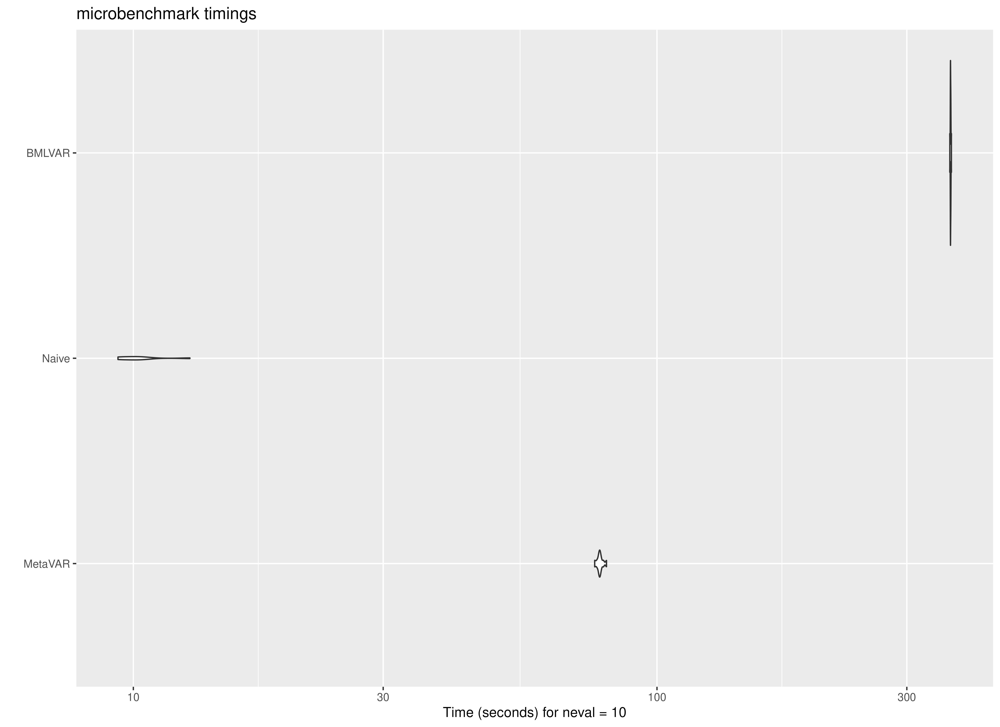
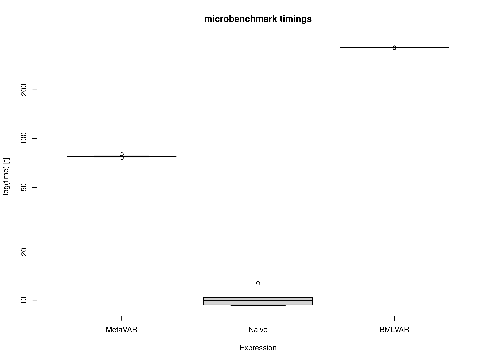

## Motivation

Two-stage approaches can offer an important computational advantage for intensive longitudinal modeling. In MetaVAR, Stage 1 consists of fitting person-specific models separately for each individual. Because these fits are independent, this step is **embarrassingly parallel**: the workload can be distributed naturally across cores on a multicore machine or across nodes in a high-performance computing environment. This makes the approach highly scalable when the number of individuals is large.

By contrast, joint Bayesian multilevel VAR estimation is generally more computationally demanding. In the implementation benchmarked here, parallelization is more limited than in the two-stage setting because computation is tied largely to MCMC chain-level parallelism. As a result, even on machines with many available cores, hardware utilization may not scale as directly as it does for the person-specific estimation step in MetaVAR. For the Bayesian benchmark, BMLVAR was fit using Mplus Version 9 on Linux.

This vignette benchmarks three approaches on the same dataset:

- **Naive**, a simple two-stage summary approach;
- **MetaVAR**, a two-stage approach that carries forward first-stage uncertainty and estimates a multivariate random-effects model at Stage 2; and
- **BMLVAR**, a joint Bayesian multilevel VAR approach.

We expected the Naive approach to be the fastest because it performs the least Stage 2 computation. We expected BMLVAR to be the slowest because it estimates the hierarchical model jointly. We expected MetaVAR to fall between these two methods, offering a compromise between computational efficiency and inferential richness. Details on the hardware and software environment used for these benchmarks are provided in the companion [session-information article](https://jeksterslab.github.io/manMetaVAR/articles/session.html) for the package website.


## Summary of Benchmark Results

The benchmark results are summarized below in seconds.

- **Naive** was the fastest method, with a mean runtime of 10.23 seconds and a median runtime of 10.07 seconds.
- **MetaVAR** had a mean runtime of 77.85 seconds and a median runtime of 77.77 seconds.
- **BMLVAR** was the slowest method, with a mean runtime of 363.67 seconds and a median runtime of 363.56 seconds.

The ordering was stable across all 10 benchmark repetitions: **Naive** was fastest, **MetaVAR** was intermediate, and **BMLVAR** was slowest. These results place MetaVAR in a computational middle ground. It is clearly slower than the Naive approach, as expected, but it remains much faster than the joint Bayesian multilevel VAR model. In absolute terms, MetaVAR required about 67.62 more seconds than Naive on this task, whereas BMLVAR required about 285.82 more seconds than MetaVAR.

Runtime variability within each method was also modest. This suggests that the observed differences reflect stable differences in computational burden rather than incidental benchmark noise.


``` r
summary(benchmark, unit = "seconds")
#>      expr        min         lq      mean    median        uq       max neval
#> 1 MetaVAR  76.041772  77.382480  77.85248  77.76870  78.23474  80.09026    10
#> 2   Naive   9.346343   9.444014  10.23400  10.06671  10.46578  12.82366    10
#> 3  BMLVAR 362.409628 363.375386 363.67246 363.56192 363.96562 364.96881    10
```

## Summary of Benchmark Results Relative to the Fastest Method

The relative benchmark results rescale runtimes so that the fastest method is set to 1.

- **Naive** is the reference method, so its relative runtime is 1.00 by definition.
- **MetaVAR** had a mean relative runtime of 7.61, meaning that it took about 8 times as long as Naive.
- **BMLVAR** had a mean relative runtime of 35.54, meaning that it took about 36 times as long as Naive.

Put differently, BMLVAR took roughly 4.7 times as long as MetaVAR on average. Thus, although MetaVAR is not as fast as the Naive approach, it substantially reduces computation time relative to the joint Bayesian alternative.

This pattern is consistent with the intended role of MetaVAR. It is not designed to match the speed of a simple summary method. Rather, it aims to provide a more principled two-stage synthesis while retaining a substantial computational advantage over joint estimation.


``` r
summary(benchmark, unit = "relative")
#>      expr       min        lq      mean    median        uq       max neval
#> 1 MetaVAR  8.135992  8.193812  7.607239  7.725337  7.475288  6.245506    10
#> 2   Naive  1.000000  1.000000  1.000000  1.000000  1.000000  1.000000    10
#> 3  BMLVAR 38.775555 38.476793 35.535711 36.115280 34.776722 28.460576    10
```

## Plot

The plots reinforce the same pattern seen in the numerical summaries. Naive is concentrated at the lowest runtimes, MetaVAR is clearly slower than Naive but far faster than BMLVAR, and BMLVAR is separated well from the other two methods by its much larger computational burden. Across repetitions, the spread within each method is relatively small compared with the differences between methods.



## Concluding Takeaway

Overall, the benchmark supports the practical value of the MetaVAR workflow. The method does introduce noticeable overhead relative to a simple Naive summary approach, which is expected given its more principled Stage 2 modeling. However, it remains far more computationally tractable than a joint Bayesian multilevel VAR model. For applied settings in which scalability matters, especially when Stage 1 can be distributed across many cores or nodes, this middle-ground computational profile is a major strength of MetaVAR.


