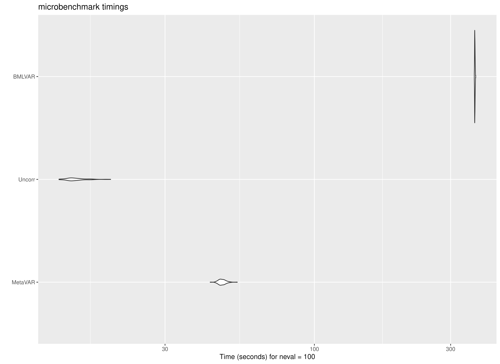
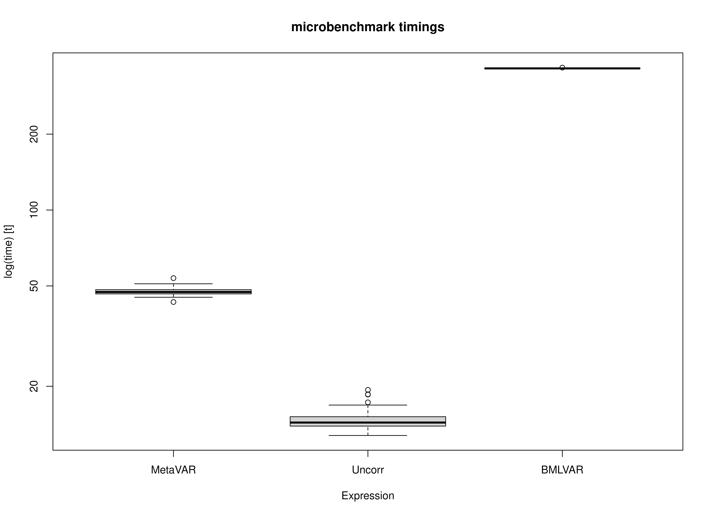

## Motivation

Two-stage approaches can offer an important computational advantage for intensive longitudinal modeling. In MetaVAR, Stage 1 consists of fitting person-specific models separately for each individual. Because these fits are independent, this step is **embarrassingly parallel**: the workload can be distributed naturally across cores on a multicore machine or across nodes in a high-performance computing environment. This makes the approach highly scalable when the number of individuals is large.

By contrast, joint Bayesian multilevel VAR estimation is generally more computationally demanding. In the implementation benchmarked here, parallelization is more limited than in the two-stage setting because computation is tied largely to MCMC chain-level parallelism. As a result, even on machines with many available cores, hardware utilization may not scale as directly as it does for the person-specific estimation step in MetaVAR. For the Bayesian benchmark, BMLVAR was fit using Mplus Version 9 on Linux.

This vignette benchmarks three approaches on the same dataset:

- **Uncorr**, an uncertainty-uncorrected two-stage benchmark that does not propagate Stage 1 sampling covariance;
- **MetaVAR**, a two-stage approach that carries forward first-stage uncertainty and estimates a multivariate random-effects model at Stage 2; and
- **BMLVAR**, a joint Bayesian multilevel VAR approach.

We expected the Uncorr approach to be the fastest because it performs the least Stage 2 computation. We expected BMLVAR to be the slowest because it estimates the hierarchical model jointly. We expected MetaVAR to fall between these two methods, offering a compromise between computational efficiency and inferential richness. Details on the hardware and software environment used for these benchmarks are provided in the companion [session-information article](https://jeksterslab.github.io/manMetaVAR/articles/session.html) for the package website.


## Summary of Benchmark Results

The benchmark results are summarized below in seconds.

- **Uncorr** was the fastest method, with a mean runtime of 14.67 seconds and a median runtime of 14.36 seconds.
- **MetaVAR** had a mean runtime of 47.55 seconds and a median runtime of 47.31 seconds.
- **BMLVAR** was the slowest method, with a mean runtime of 364.61 seconds and a median runtime of 364.48 seconds.

The ordering was stable across all 100 benchmark repetitions: **Uncorr** was fastest, **MetaVAR** was intermediate, and **BMLVAR** was slowest. These results place MetaVAR in a computational middle ground. It is clearly slower than the Uncorr approach, as expected, but it remains much faster than the joint Bayesian multilevel VAR model. In absolute terms, MetaVAR required about 32.88 more seconds than Uncorr on this task, whereas BMLVAR required about 317.06 more seconds than MetaVAR.

Runtime variability within each method was also modest. This suggests that the observed differences reflect stable differences in computational burden rather than incidental benchmark noise.


``` r
summary(benchmark, unit = "seconds")
#>      expr       min        lq      mean    median        uq       max neval
#> 1 MetaVAR  43.17602  46.49405  47.54943  47.31046  48.31051  53.70043   100
#> 2  Uncorr  12.75974  13.90272  14.66962  14.35964  15.14774  19.35440   100
#> 3  BMLVAR 362.99736 364.08500 364.60915 364.48380 365.05887 367.14739   100
```

## Summary of Benchmark Results Relative to the Fastest Method

The relative benchmark results rescale runtimes so that the fastest method is set to 1.

- **Uncorr** is the reference method, so its relative runtime is 1.00 by definition.
- **MetaVAR** had a mean relative runtime of 3.24, meaning that it took about 3 times as long as Uncorr.
- **BMLVAR** had a mean relative runtime of 24.85, meaning that it took about 25 times as long as Uncorr.

Put differently, BMLVAR took roughly 7.7 times as long as MetaVAR on average. Thus, although MetaVAR is not as fast as the Uncorr approach, it substantially reduces computation time relative to the joint Bayesian alternative.

This pattern is consistent with the intended role of MetaVAR. It is not designed to match the speed of a simple summary method. Rather, it aims to provide a more principled two-stage synthesis while retaining a substantial computational advantage over joint estimation.


``` r
summary(benchmark, unit = "relative")
#>      expr      min        lq      mean    median        uq       max neval
#> 1 MetaVAR  3.38377  3.344241  3.241353  3.294684  3.189288  2.774586   100
#> 2  Uncorr  1.00000  1.000000  1.000000  1.000000  1.000000  1.000000   100
#> 3  BMLVAR 28.44865 26.188040 24.854707 25.382525 24.099892 18.969715   100
```

## Plot

The plots reinforce the same pattern seen in the numerical summaries. Uncorr is concentrated at the lowest runtimes, MetaVAR is clearly slower than Uncorr but far faster than BMLVAR, and BMLVAR is separated well from the other two methods by its much larger computational burden. Across repetitions, the spread within each method is relatively small compared with the differences between methods.



## Concluding Takeaway

Overall, the benchmark supports the practical value of the MetaVAR workflow. The method does introduce noticeable overhead relative to a simple Uncorr summary approach, which is expected given its more principled Stage 2 modeling. However, it remains far more computationally tractable than a joint Bayesian multilevel VAR model. For applied settings in which scalability matters, especially when Stage 1 can be distributed across many cores or nodes, this middle-ground computational profile is a major strength of MetaVAR.


