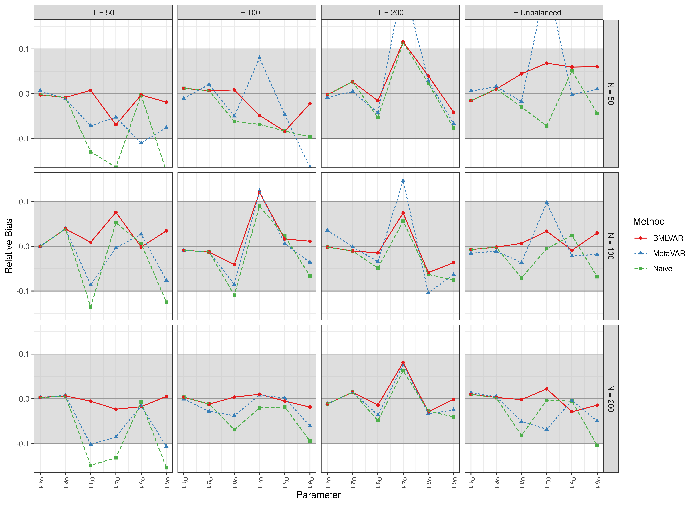
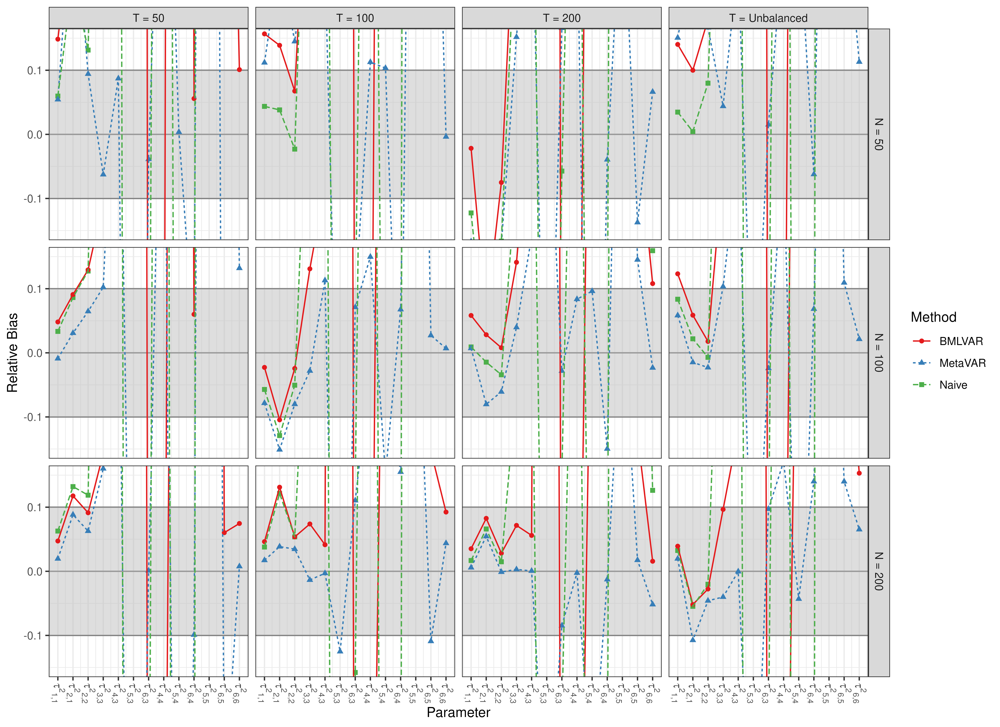
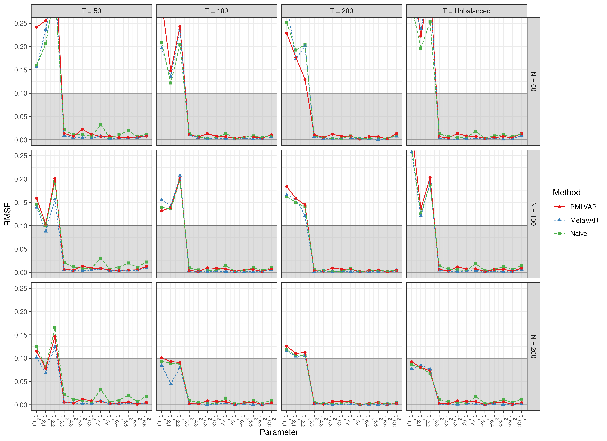
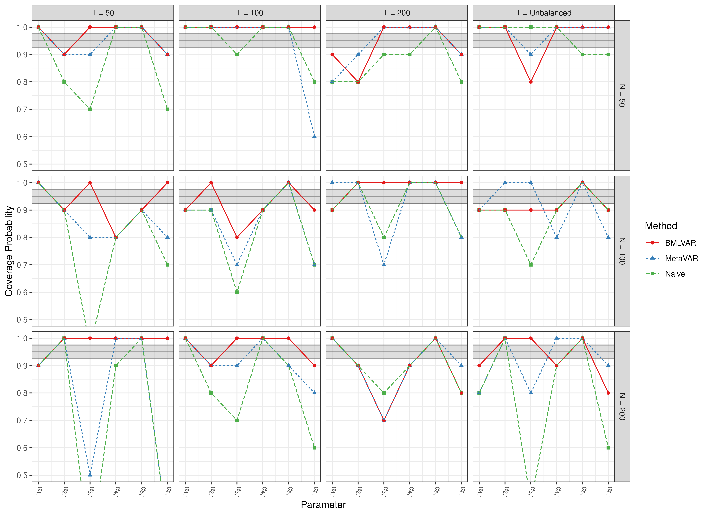
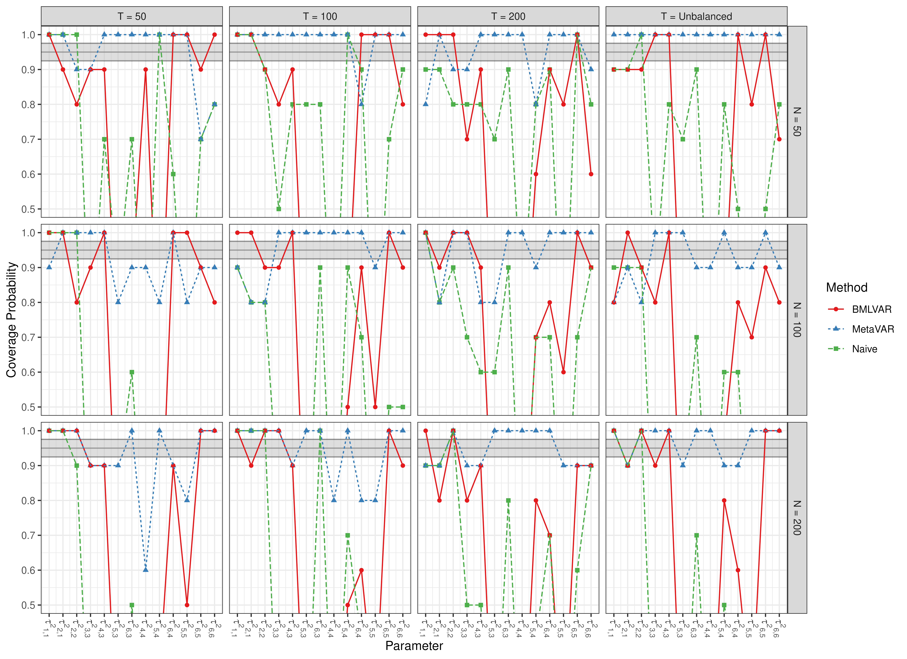
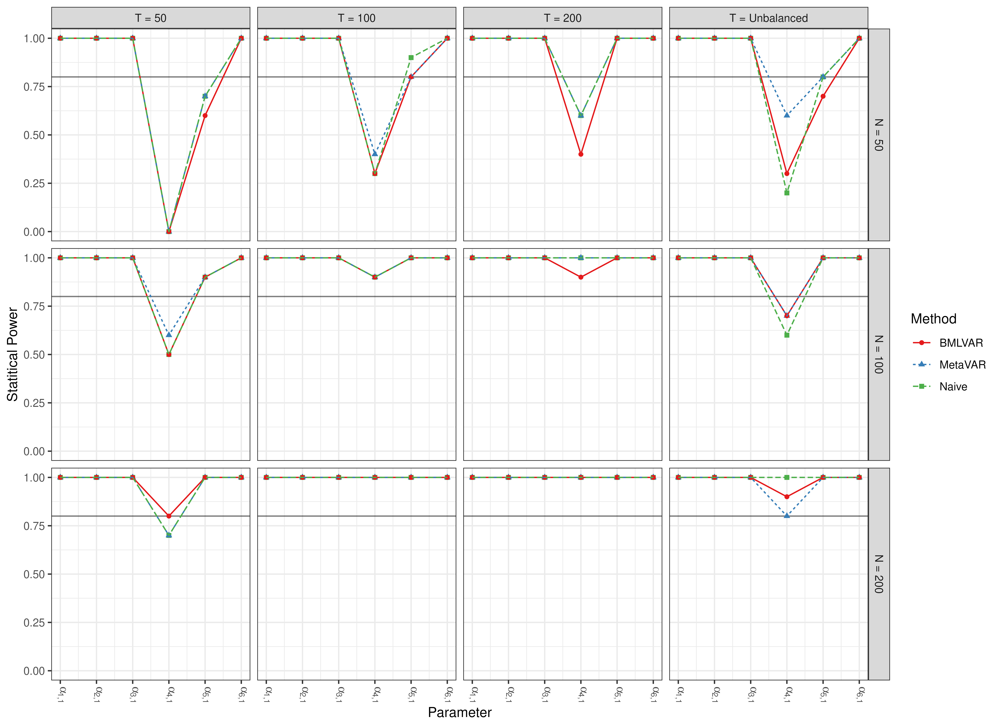
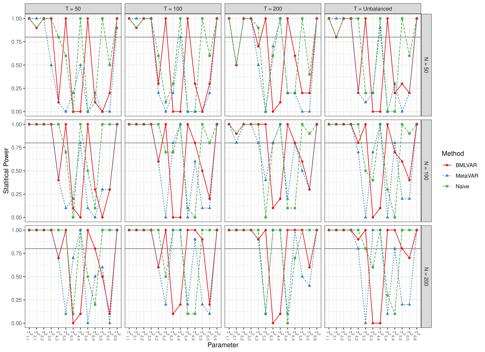

``` r
library(manMetaVAR)
```


``` r
data(results, package = "manMetaVAR")
```

### Bias

#### Fixed Effects



#### Random Effects



### RMSE

#### Fixed Effects


#### Random Effects



### Coverage Probabilities

#### Fixed Effects



#### Random Effects



### Statistical Power

#### Fixed Effects



#### Random Effects


