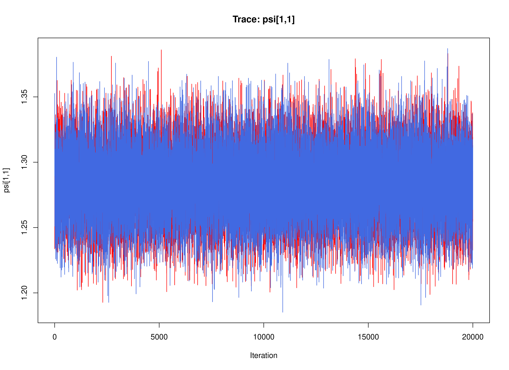
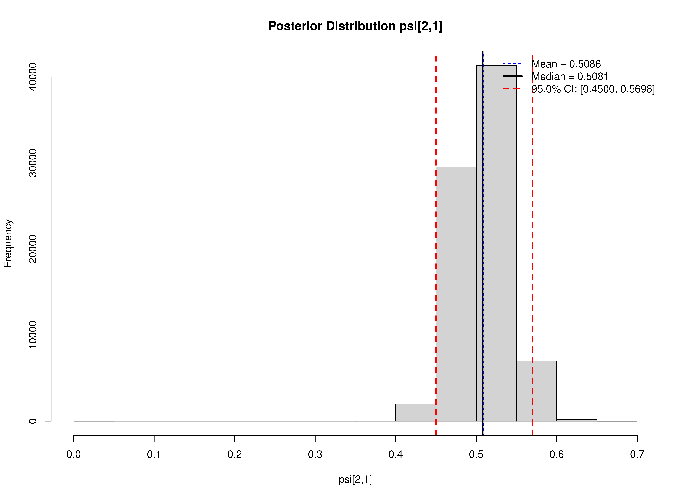
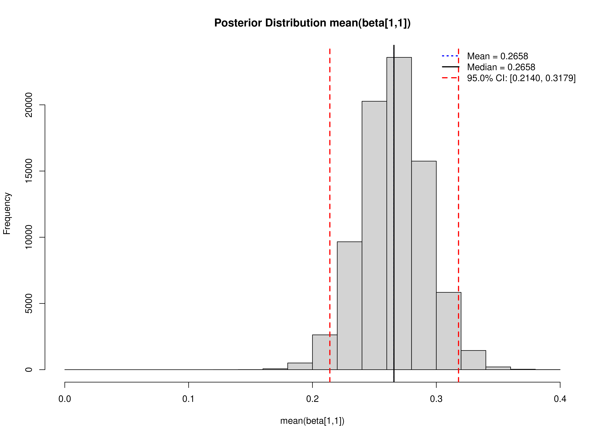
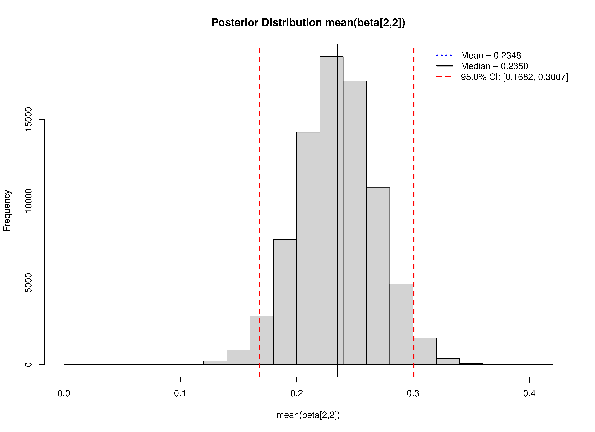
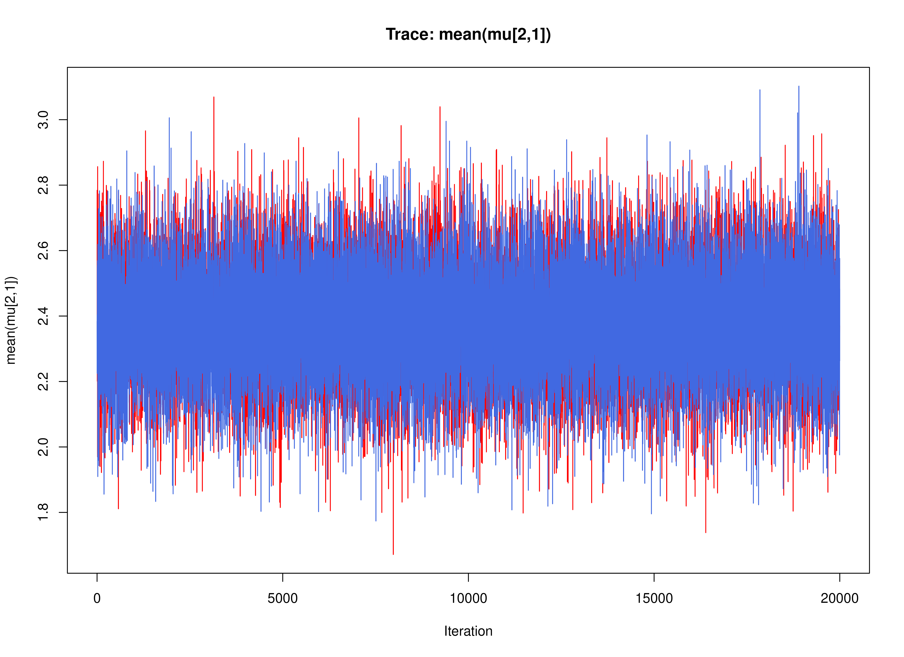
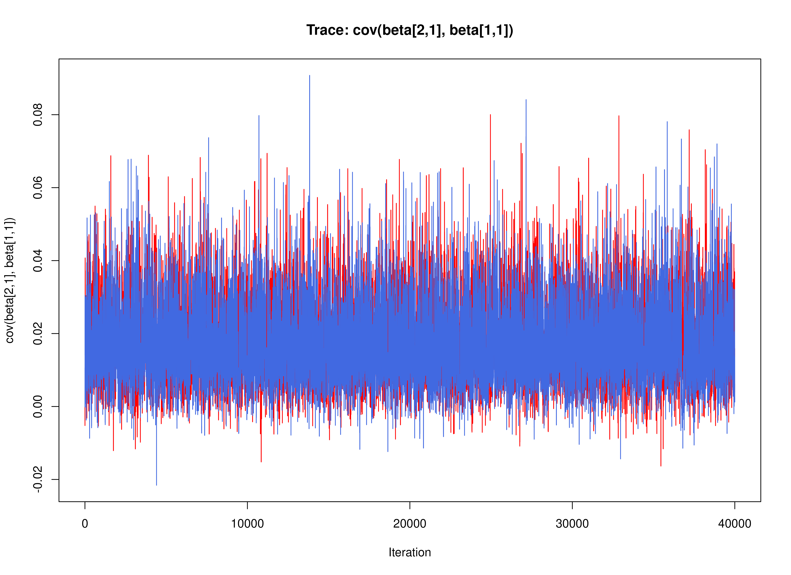
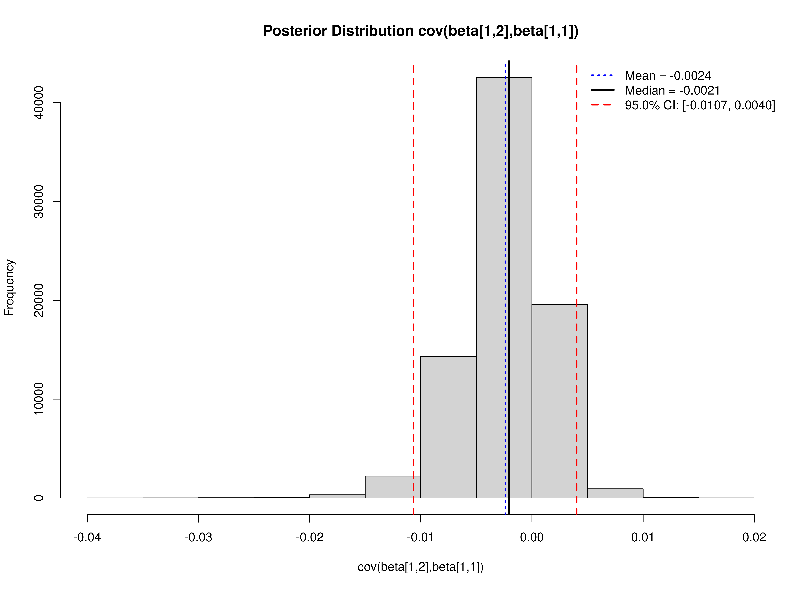
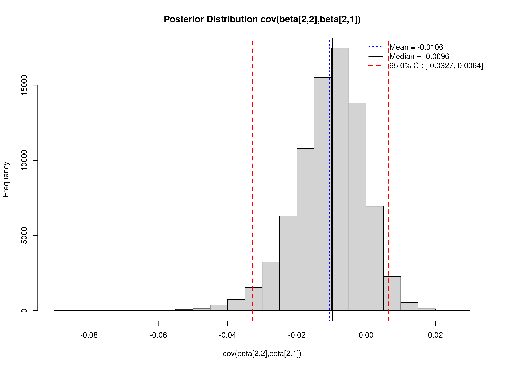
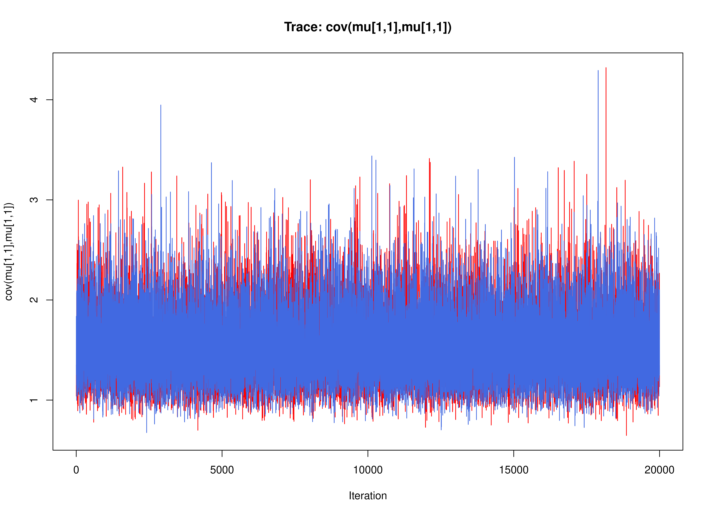

``` r
library(OpenMx)
library(fitVARMxID)
library(metaDyn)
library(manMetaVAR)
```


## Data Generation


``` r
taskid <- 10
seed <- 42
set.seed(seed)
data <- GenData(
  taskid = taskid,
  seed = seed
)
```


``` r
plot(data)
```


``` r
summary(data)
#>        id             time              y1               y2        
#>  Min.   : 1.00   Min.   :  0.00   Min.   :-3.247   Min.   :-4.140  
#>  1st Qu.:13.00   1st Qu.: 28.00   1st Qu.: 1.798   1st Qu.: 1.060  
#>  Median :26.00   Median : 61.00   Median : 2.941   Median : 2.191  
#>  Mean   :25.57   Mean   : 73.63   Mean   : 2.890   Mean   : 2.175  
#>  3rd Qu.:38.00   3rd Qu.:110.00   3rd Qu.: 3.988   3rd Qu.: 3.250  
#>  Max.   :50.00   Max.   :199.00   Max.   : 9.199   Max.   : 8.406
```

## MetaVAR


``` r
dtvar <- FitDTVAR(
  data = data,
  seed = seed
)
```


``` r
summary(dtvar, means = TRUE)
#> Call:
#> FitVARMxID(data = data$data, observed = paste0("y", seq_len(model$k)), 
#>     id = "id", time = NULL, ct = FALSE, center = TRUE, mu_fixed = FALSE, 
#>     mu_free = NULL, mu_values = data$mu, mu_lbound = NULL, mu_ubound = NULL, 
#>     alpha_fixed = FALSE, alpha_free = NULL, alpha_values = NULL, 
#>     alpha_lbound = NULL, alpha_ubound = NULL, beta_fixed = FALSE, 
#>     beta_free = NULL, beta_values = data$beta, beta_lbound = NULL, 
#>     beta_ubound = NULL, psi_diag = FALSE, psi_fixed = FALSE, 
#>     psi_d_free = NULL, psi_d_values = model$psi_d_ldl, psi_d_lbound = NULL, 
#>     psi_d_ubound = NULL, psi_d_equal = FALSE, psi_l_free = NULL, 
#>     psi_l_values = model$psi_l_ldl, psi_l_lbound = NULL, psi_l_ubound = NULL, 
#>     nu_fixed = TRUE, nu_free = NULL, nu_values = NULL, nu_lbound = NULL, 
#>     nu_ubound = NULL, theta_diag = TRUE, theta_fixed = TRUE, 
#>     theta_d_free = NULL, theta_d_values = NULL, theta_d_lbound = NULL, 
#>     theta_d_ubound = NULL, theta_d_equal = FALSE, theta_l_free = NULL, 
#>     theta_l_values = NULL, theta_l_lbound = NULL, theta_l_ubound = NULL, 
#>     mu0_fixed = TRUE, mu0_func = TRUE, mu0_free = NULL, mu0_values = NULL, 
#>     mu0_lbound = NULL, mu0_ubound = NULL, sigma0_fixed = TRUE, 
#>     sigma0_func = TRUE, sigma0_diag = FALSE, sigma0_d_free = NULL, 
#>     sigma0_d_values = NULL, sigma0_d_lbound = NULL, sigma0_d_ubound = NULL, 
#>     sigma0_d_equal = FALSE, sigma0_l_free = NULL, sigma0_l_values = NULL, 
#>     sigma0_l_lbound = NULL, sigma0_l_ubound = NULL, robust = FALSE, 
#>     seed = seed, silent = TRUE, ncores = ncores)
#> 
#> Convergence:
#> 100.0%
#> 
#> Means of the estimated paramaters per individual.
#>   mu[1,1]   mu[2,1] beta[1,1] beta[2,1] beta[1,2] beta[2,2]  psi[1,1]  psi[2,1] 
#>    2.8930    2.3276    0.2549   -0.0486   -0.0590    0.2070    1.2448    0.5272 
#>  psi[2,2] 
#>    1.4661
```


``` r
metavar <- FitMetaVAR(
  fit = dtvar,
  seed = seed
)
```


``` r
summary(metavar)
#> Call:
#> MetaVARMx(object = fit$output, x = NULL, random = TRUE, alpha_values = model$ma_fixed, 
#>     tau_sqr_diag = FALSE, tau_sqr_d_free = TRUE, tau_sqr_d_values = model$ma_random_d_ldl, 
#>     tau_sqr_l_free = matrix(data = c(FALSE, FALSE, FALSE, FALSE, 
#>         FALSE, FALSE, TRUE, FALSE, FALSE, FALSE, FALSE, FALSE, 
#>         FALSE, FALSE, FALSE, FALSE, FALSE, FALSE, FALSE, FALSE, 
#>         TRUE, FALSE, FALSE, FALSE, FALSE, FALSE, TRUE, TRUE, 
#>         FALSE, FALSE, FALSE, FALSE, TRUE, TRUE, TRUE, FALSE), 
#>         byrow = TRUE, nrow = 6, ncol = 6), tau_sqr_l_values = model$ma_random_l_ldl, 
#>     effects = TRUE, set_point = TRUE, int_meas = FALSE, int_dyn = FALSE, 
#>     cov_meas = FALSE, cov_dyn = FALSE, robust_v = FALSE, robust = FALSE, 
#>     seed = seed, silent = TRUE, ncores = ncores)
#> 
#> Status code:
#> 0
#> 
#> CI type:
#> "normal"
#> 
#>                  est     se        z      p    2.5%   97.5%
#> alpha[1,1]    2.8951 0.1661  17.4252 0.0000  2.5695  3.2208
#> alpha[2,1]    2.3329 0.1456  16.0172 0.0000  2.0474  2.6183
#> alpha[3,1]    0.2561 0.0225  11.3805 0.0000  0.2120  0.3002
#> alpha[4,1]   -0.0658 0.0212  -3.0991 0.0019 -0.1074 -0.0242
#> alpha[5,1]   -0.0532 0.0140  -3.8035 0.0001 -0.0806 -0.0258
#> alpha[6,1]    0.2211 0.0290   7.6128 0.0000  0.1642  0.2780
#> tau_sqr[1,1]  1.3523 0.2765   4.8904 0.0000  0.8103  1.8943
#> tau_sqr[2,1]  0.5742 0.1902   3.0189 0.0025  0.2014  0.9470
#> tau_sqr[2,2]  1.0252 0.2126   4.8216 0.0000  0.6085  1.4420
#> tau_sqr[3,3]  0.0146 0.0049   2.9567 0.0031  0.0049  0.0243
#> tau_sqr[4,3]  0.0067 0.0036   1.8437 0.0652 -0.0004  0.0138
#> tau_sqr[5,3] -0.0009 0.0024  -0.3728 0.7093 -0.0056  0.0038
#> tau_sqr[6,3]  0.0104 0.0048   2.1575 0.0310  0.0010  0.0199
#> tau_sqr[4,4]  0.0101 0.0043   2.3442 0.0191  0.0017  0.0186
#> tau_sqr[5,4]  0.0012 0.0020   0.5972 0.5504 -0.0027  0.0050
#> tau_sqr[6,4]  0.0030 0.0043   0.7114 0.4768 -0.0053  0.0114
#> tau_sqr[5,5]  0.0016 0.0022   0.7533 0.4513 -0.0026  0.0059
#> tau_sqr[6,5]  0.0003 0.0029   0.0994 0.9208 -0.0054  0.0060
#> tau_sqr[6,6]  0.0311 0.0083   3.7351 0.0002  0.0148  0.0475
#> i_sqr[1,1]    0.9876 0.0025 393.4389 0.0000  0.9827  0.9925
#> i_sqr[2,1]    0.9804 0.0040 245.9489 0.0000  0.9726  0.9883
#> i_sqr[3,1]    0.6171 0.0799   7.7224 0.0000  0.4605  0.7737
#> i_sqr[4,1]    0.4403 0.1131   3.8912 0.0001  0.2185  0.6620
#> i_sqr[5,1]    0.2825 0.1511   1.8696 0.0615 -0.0137  0.5787
#> i_sqr[6,1]    0.8221 0.0372  22.1173 0.0000  0.7493  0.8950
```

## Mplus


``` r
mplus <- FitMplus(
  data = data,
  seed = seed
)
```


``` r
summary(mplus)
#>                               est     se     R    2.5%   97.5%
#> psi[1,1]                   1.2997 0.0245 80000  1.2528  1.3489
#> psi[2,1]                   0.5576 0.0205 80000  0.5185  0.5982
#> psi[2,2]                   1.5381 0.0291 80000  1.4823  1.5965
#> mean(beta[1,1])            0.2658 0.0264 80000  0.2140  0.3179
#> mean(beta[2,1])           -0.0659 0.0243 80000 -0.1130 -0.0169
#> mean(beta[1,2])           -0.0537 0.0169 80000 -0.0872 -0.0205
#> mean(beta[2,2])            0.2350 0.0336 80000  0.1682  0.3007
#> mean(mu[1,1])              2.8979 0.1794 80000  2.5420  3.2506
#> mean(mu[2,1])              2.3268 0.1569 80000  2.0183  2.6342
#> cov(beta[1,1],beta[1,1])   0.0217 0.0093 80000  0.0112  0.0420
#> cov(beta[2,1], beta[1,1])  0.0088 0.0056 80000  0.0004  0.0225
#> cov(beta[2,1],beta[2,1])   0.0151 0.0084 80000  0.0061  0.0325
#> cov(beta[1,2],beta[1,1])  -0.0021 0.0037 80000 -0.0107  0.0040
#> cov(beta[1,2],beta[2,1])   0.0013 0.0032 80000 -0.0052  0.0076
#> cov(beta[1,2],beta[1,2])   0.0048 0.0059 80000  0.0013  0.0133
#> cov(beta[2,2],beta[1,1])   0.0130 0.0074 80000  0.0005  0.0301
#> cov(beta[2,2],beta[2,1])   0.0029 0.0065 80000 -0.0102  0.0157
#> cov(beta[2,2],beta[1,2])   0.0014 0.0046 80000 -0.0069  0.0115
#> cov(beta[2,2],beta[2,2])   0.0422 0.0138 80000  0.0243  0.0747
#> cov(mu[1,1],mu[1,1])       1.5259 0.3539 80000  1.0216  2.3955
#> cov(mu[2,1],mu[1,1])       0.6482 0.2439 80000  0.2750  1.2270
#> cov(mu[2,1],mu[2,1])       1.1664 0.2749 80000  0.7768  1.8436
```


``` r
coef(mplus)
#>                  psi[1,1]                  psi[2,1]                  psi[2,2] 
#>                  1.299690                  0.557640                  1.538150 
#>           mean(beta[1,1])           mean(beta[2,1])           mean(beta[1,2]) 
#>                  0.265790                 -0.065930                 -0.053740 
#>           mean(beta[2,2])             mean(mu[1,1])             mean(mu[2,1]) 
#>                  0.235020                  2.897875                  2.326820 
#>  cov(beta[1,1],beta[1,1]) cov(beta[2,1], beta[1,1])  cov(beta[2,1],beta[2,1]) 
#>                  0.021730                  0.008830                  0.015100 
#>  cov(beta[1,2],beta[1,1])  cov(beta[1,2],beta[2,1])  cov(beta[1,2],beta[1,2]) 
#>                 -0.002060                  0.001320                  0.004810 
#>  cov(beta[2,2],beta[1,1])  cov(beta[2,2],beta[2,1])  cov(beta[2,2],beta[1,2]) 
#>                  0.013040                  0.002850                  0.001450 
#>  cov(beta[2,2],beta[2,2])      cov(mu[1,1],mu[1,1])      cov(mu[2,1],mu[1,1]) 
#>                  0.042150                  1.525950                  0.648185 
#>      cov(mu[2,1],mu[2,1]) 
#>                  1.166365
```


``` r
vcov(mplus)
#>                                psi[1,1]      psi[2,1]      psi[2,2]
#> psi[1,1]                   6.011430e-04  2.578751e-04  1.111061e-04
#> psi[2,1]                   2.578751e-04  4.212409e-04  3.099608e-04
#> psi[2,2]                   1.111061e-04  3.099608e-04  8.489078e-04
#> mean(beta[1,1])            4.665108e-07 -1.979524e-06 -3.587198e-06
#> mean(beta[2,1])            1.818003e-06  1.466471e-06 -6.950930e-06
#> mean(beta[1,2])            2.665926e-06  5.884659e-06  4.859973e-06
#> mean(beta[2,2])           -4.483612e-06  3.476255e-06  9.994828e-06
#> mean(mu[1,1])              2.492690e-05  7.635059e-06 -2.548229e-05
#> mean(mu[2,1])              1.625315e-05  9.038175e-06 -2.545665e-05
#> cov(beta[1,1],beta[1,1])  -2.567731e-06 -1.482490e-05 -5.419533e-06
#> cov(beta[2,1], beta[1,1]) -2.184635e-06 -2.461513e-06 -2.087431e-06
#> cov(beta[2,1],beta[2,1])   3.540883e-07 -1.575631e-05 -1.023452e-05
#> cov(beta[1,2],beta[1,1])   2.090166e-06  9.166240e-07  4.506451e-07
#> cov(beta[1,2],beta[2,1])   7.448303e-07  1.115372e-06  1.512597e-06
#> cov(beta[1,2],beta[1,2])  -2.001453e-06 -1.526452e-05 -5.304346e-06
#> cov(beta[2,2],beta[1,1])   1.531802e-06  1.434757e-06 -4.354801e-07
#> cov(beta[2,2],beta[2,1])   1.110595e-06  1.561562e-06  1.935587e-06
#> cov(beta[2,2],beta[1,2])  -6.187418e-07 -1.854614e-06 -7.467501e-07
#> cov(beta[2,2],beta[2,2])   1.207397e-06 -1.473430e-05 -1.086736e-05
#> cov(mu[1,1],mu[1,1])      -9.970645e-07 -3.171432e-05 -7.038720e-06
#> cov(mu[2,1],mu[1,1])      -2.465360e-06 -1.478780e-05 -8.582027e-06
#> cov(mu[2,1],mu[2,1])       6.880111e-06  1.991190e-05 -1.851064e-05
#>                           mean(beta[1,1]) mean(beta[2,1]) mean(beta[1,2])
#> psi[1,1]                     4.665108e-07    1.818003e-06    2.665926e-06
#> psi[2,1]                    -1.979524e-06    1.466471e-06    5.884659e-06
#> psi[2,2]                    -3.587198e-06   -6.950930e-06    4.859973e-06
#> mean(beta[1,1])              6.967775e-04    2.934238e-04   -1.194349e-04
#> mean(beta[2,1])              2.934238e-04    5.927277e-04    7.321855e-07
#> mean(beta[1,2])             -1.194349e-04    7.321855e-07    2.844964e-04
#> mean(beta[2,2])              2.449070e-04   -2.987555e-05    1.067004e-04
#> mean(mu[1,1])                6.700807e-06   -1.521443e-05   -7.724714e-06
#> mean(mu[2,1])                1.384592e-05   -1.559666e-05   -8.003261e-07
#> cov(beta[1,1],beta[1,1])     1.510375e-06    5.583283e-06   -5.328497e-07
#> cov(beta[2,1], beta[1,1])    8.430484e-06    7.473980e-06   -2.696682e-06
#> cov(beta[2,1],beta[2,1])    -1.324822e-06    1.576193e-05   -7.536372e-07
#> cov(beta[1,2],beta[1,1])    -4.916498e-07   -1.375728e-07    2.101726e-06
#> cov(beta[1,2],beta[2,1])    -2.739272e-06   -2.423685e-06    4.476248e-06
#> cov(beta[1,2],beta[1,2])    -7.734548e-06    5.917324e-07    8.049645e-07
#> cov(beta[2,2],beta[1,1])     5.677251e-07    2.699762e-07    2.497493e-06
#> cov(beta[2,2],beta[2,1])    -5.051502e-07   -2.384973e-06    2.643263e-06
#> cov(beta[2,2],beta[1,2])     2.183298e-06    1.140451e-06   -2.533509e-06
#> cov(beta[2,2],beta[2,2])    -5.125971e-06    9.575966e-06   -8.805831e-07
#> cov(mu[1,1],mu[1,1])        -1.007048e-04   -9.700686e-05    9.503753e-06
#> cov(mu[2,1],mu[1,1])        -4.676840e-06   -4.314738e-05   -4.980468e-06
#> cov(mu[2,1],mu[2,1])         2.840646e-06   -5.791621e-05    2.180104e-07
#>                           mean(beta[2,2]) mean(mu[1,1]) mean(mu[2,1])
#> psi[1,1]                    -4.483612e-06  2.492690e-05  1.625315e-05
#> psi[2,1]                     3.476255e-06  7.635059e-06  9.038175e-06
#> psi[2,2]                     9.994828e-06 -2.548229e-05 -2.545665e-05
#> mean(beta[1,1])              2.449070e-04  6.700807e-06  1.384592e-05
#> mean(beta[2,1])             -2.987555e-05 -1.521443e-05 -1.559666e-05
#> mean(beta[1,2])              1.067004e-04 -7.724714e-06 -8.003261e-07
#> mean(beta[2,2])              1.130087e-03 -4.030758e-07 -1.461202e-05
#> mean(mu[1,1])               -4.030758e-07  3.220145e-02  1.355340e-02
#> mean(mu[2,1])               -1.461202e-05  1.355340e-02  2.461164e-02
#> cov(beta[1,1],beta[1,1])    -7.969669e-06 -6.930629e-06 -1.464087e-05
#> cov(beta[2,1], beta[1,1])   -7.270201e-07 -3.780589e-06 -8.566037e-06
#> cov(beta[2,1],beta[2,1])    -1.167253e-05  3.757119e-07 -6.574450e-06
#> cov(beta[1,2],beta[1,1])     9.333046e-07 -2.983439e-06  1.198750e-06
#> cov(beta[1,2],beta[2,1])     1.644386e-06 -6.895311e-07  2.938641e-06
#> cov(beta[1,2],beta[1,2])    -5.869864e-06 -1.156715e-06 -2.833091e-06
#> cov(beta[2,2],beta[1,1])     5.951051e-07 -6.982999e-06 -3.649644e-06
#> cov(beta[2,2],beta[2,1])     8.364588e-06  2.518915e-06 -1.730509e-06
#> cov(beta[2,2],beta[1,2])    -1.522733e-06  2.800091e-06  1.753456e-06
#> cov(beta[2,2],beta[2,2])    -1.435605e-05  1.087898e-05  1.237967e-05
#> cov(mu[1,1],mu[1,1])        -3.088815e-05 -2.322307e-04 -3.466462e-06
#> cov(mu[2,1],mu[1,1])         1.021193e-07  5.108757e-05  1.301801e-04
#> cov(mu[2,1],mu[2,1])         6.648867e-05 -1.077403e-04 -5.712663e-05
#>                           cov(beta[1,1],beta[1,1]) cov(beta[2,1], beta[1,1])
#> psi[1,1]                             -2.567731e-06             -2.184635e-06
#> psi[2,1]                             -1.482490e-05             -2.461513e-06
#> psi[2,2]                             -5.419533e-06             -2.087431e-06
#> mean(beta[1,1])                       1.510375e-06              8.430484e-06
#> mean(beta[2,1])                       5.583283e-06              7.473980e-06
#> mean(beta[1,2])                      -5.328497e-07             -2.696682e-06
#> mean(beta[2,2])                      -7.969669e-06             -7.270201e-07
#> mean(mu[1,1])                        -6.930629e-06             -3.780589e-06
#> mean(mu[2,1])                        -1.464087e-05             -8.566037e-06
#> cov(beta[1,1],beta[1,1])              8.698817e-05              2.672648e-05
#> cov(beta[2,1], beta[1,1])             2.672648e-05              3.158531e-05
#> cov(beta[2,1],beta[2,1])              3.716566e-05              2.309145e-05
#> cov(beta[1,2],beta[1,1])             -1.181744e-05             -2.738627e-06
#> cov(beta[1,2],beta[2,1])             -5.082144e-06             -4.602614e-06
#> cov(beta[1,2],beta[1,2])              2.722284e-05              5.570573e-08
#> cov(beta[2,2],beta[1,1])              2.398067e-05              4.748166e-06
#> cov(beta[2,2],beta[2,1])              9.064898e-06              9.138752e-06
#> cov(beta[2,2],beta[1,2])             -4.215033e-06             -6.683286e-08
#> cov(beta[2,2],beta[2,2])              3.417712e-05             -2.100004e-07
#> cov(mu[1,1],mu[1,1])                 -2.898000e-05             -1.785610e-05
#> cov(mu[2,1],mu[1,1])                 -2.235159e-05             -9.114509e-06
#> cov(mu[2,1],mu[2,1])                  3.256720e-06             -1.829019e-06
#>                           cov(beta[2,1],beta[2,1]) cov(beta[1,2],beta[1,1])
#> psi[1,1]                              3.540883e-07             2.090166e-06
#> psi[2,1]                             -1.575631e-05             9.166240e-07
#> psi[2,2]                             -1.023452e-05             4.506451e-07
#> mean(beta[1,1])                      -1.324822e-06            -4.916498e-07
#> mean(beta[2,1])                       1.576193e-05            -1.375728e-07
#> mean(beta[1,2])                      -7.536372e-07             2.101726e-06
#> mean(beta[2,2])                      -1.167253e-05             9.333046e-07
#> mean(mu[1,1])                         3.757119e-07            -2.983439e-06
#> mean(mu[2,1])                        -6.574450e-06             1.198750e-06
#> cov(beta[1,1],beta[1,1])              3.716566e-05            -1.181744e-05
#> cov(beta[2,1], beta[1,1])             2.309145e-05            -2.738627e-06
#> cov(beta[2,1],beta[2,1])              7.040985e-05            -4.195750e-07
#> cov(beta[1,2],beta[1,1])             -4.195750e-07             1.374802e-05
#> cov(beta[1,2],beta[2,1])             -9.055626e-09             5.356939e-06
#> cov(beta[1,2],beta[1,2])              2.485377e-05            -4.713211e-06
#> cov(beta[2,2],beta[1,1])             -4.598642e-07             1.854582e-06
#> cov(beta[2,2],beta[2,1])             -8.956643e-07             2.039725e-06
#> cov(beta[2,2],beta[1,2])             -3.017564e-07             4.110188e-06
#> cov(beta[2,2],beta[2,2])              2.460196e-05             3.089588e-06
#> cov(mu[1,1],mu[1,1])                 -1.115896e-05            -4.172284e-06
#> cov(mu[2,1],mu[1,1])                 -2.004309e-05            -6.963011e-06
#> cov(mu[2,1],mu[2,1])                  7.771333e-06            -9.996596e-06
#>                           cov(beta[1,2],beta[2,1]) cov(beta[1,2],beta[1,2])
#> psi[1,1]                              7.448303e-07            -2.001453e-06
#> psi[2,1]                              1.115372e-06            -1.526452e-05
#> psi[2,2]                              1.512597e-06            -5.304346e-06
#> mean(beta[1,1])                      -2.739272e-06            -7.734548e-06
#> mean(beta[2,1])                      -2.423685e-06             5.917324e-07
#> mean(beta[1,2])                       4.476248e-06             8.049645e-07
#> mean(beta[2,2])                       1.644386e-06            -5.869864e-06
#> mean(mu[1,1])                        -6.895311e-07            -1.156715e-06
#> mean(mu[2,1])                         2.938641e-06            -2.833091e-06
#> cov(beta[1,1],beta[1,1])             -5.082144e-06             2.722284e-05
#> cov(beta[2,1], beta[1,1])            -4.602614e-06             5.570573e-08
#> cov(beta[2,1],beta[2,1])             -9.055626e-09             2.485377e-05
#> cov(beta[1,2],beta[1,1])              5.356939e-06            -4.713211e-06
#> cov(beta[1,2],beta[2,1])              1.019156e-05             5.745675e-08
#> cov(beta[1,2],beta[1,2])              5.745675e-08             3.471913e-05
#> cov(beta[2,2],beta[1,1])              1.407870e-06            -1.764178e-06
#> cov(beta[2,2],beta[2,1])              3.245522e-06            -2.845893e-08
#> cov(beta[2,2],beta[1,2])              1.498100e-08             3.007679e-06
#> cov(beta[2,2],beta[2,2])             -2.797617e-07             2.583393e-05
#> cov(mu[1,1],mu[1,1])                  4.289445e-06             8.432778e-06
#> cov(mu[2,1],mu[1,1])                 -2.129549e-06            -9.628633e-06
#> cov(mu[2,1],mu[2,1])                 -5.961644e-06             1.253078e-05
#>                           cov(beta[2,2],beta[1,1]) cov(beta[2,2],beta[2,1])
#> psi[1,1]                              1.531802e-06             1.110595e-06
#> psi[2,1]                              1.434757e-06             1.561562e-06
#> psi[2,2]                             -4.354801e-07             1.935587e-06
#> mean(beta[1,1])                       5.677251e-07            -5.051502e-07
#> mean(beta[2,1])                       2.699762e-07            -2.384973e-06
#> mean(beta[1,2])                       2.497493e-06             2.643263e-06
#> mean(beta[2,2])                       5.951051e-07             8.364588e-06
#> mean(mu[1,1])                        -6.982999e-06             2.518915e-06
#> mean(mu[2,1])                        -3.649644e-06            -1.730509e-06
#> cov(beta[1,1],beta[1,1])              2.398067e-05             9.064898e-06
#> cov(beta[2,1], beta[1,1])             4.748166e-06             9.138752e-06
#> cov(beta[2,1],beta[2,1])             -4.598642e-07            -8.956643e-07
#> cov(beta[1,2],beta[1,1])              1.854582e-06             2.039725e-06
#> cov(beta[1,2],beta[2,1])              1.407870e-06             3.245522e-06
#> cov(beta[1,2],beta[1,2])             -1.764178e-06            -2.845893e-08
#> cov(beta[2,2],beta[1,1])              5.540296e-05             2.056741e-05
#> cov(beta[2,2],beta[2,1])              2.056741e-05             4.224385e-05
#> cov(beta[2,2],beta[1,2])             -7.108179e-06             1.980759e-07
#> cov(beta[2,2],beta[2,2])              3.752049e-05            -3.195931e-06
#> cov(mu[1,1],mu[1,1])                 -1.513020e-05            -1.277881e-05
#> cov(mu[2,1],mu[1,1])                 -9.023581e-06            -1.810876e-06
#> cov(mu[2,1],mu[2,1])                 -8.301910e-06            -2.745993e-06
#>                           cov(beta[2,2],beta[1,2]) cov(beta[2,2],beta[2,2])
#> psi[1,1]                             -6.187418e-07             1.207397e-06
#> psi[2,1]                             -1.854614e-06            -1.473430e-05
#> psi[2,2]                             -7.467501e-07            -1.086736e-05
#> mean(beta[1,1])                       2.183298e-06            -5.125971e-06
#> mean(beta[2,1])                       1.140451e-06             9.575966e-06
#> mean(beta[1,2])                      -2.533509e-06            -8.805831e-07
#> mean(beta[2,2])                      -1.522733e-06            -1.435605e-05
#> mean(mu[1,1])                         2.800091e-06             1.087898e-05
#> mean(mu[2,1])                         1.753456e-06             1.237967e-05
#> cov(beta[1,1],beta[1,1])             -4.215033e-06             3.417712e-05
#> cov(beta[2,1], beta[1,1])            -6.683286e-08            -2.100004e-07
#> cov(beta[2,1],beta[2,1])             -3.017564e-07             2.460196e-05
#> cov(beta[1,2],beta[1,1])              4.110188e-06             3.089588e-06
#> cov(beta[1,2],beta[2,1])              1.498100e-08            -2.797617e-07
#> cov(beta[1,2],beta[1,2])              3.007679e-06             2.583393e-05
#> cov(beta[2,2],beta[1,1])             -7.108179e-06             3.752049e-05
#> cov(beta[2,2],beta[2,1])              1.980759e-07            -3.195931e-06
#> cov(beta[2,2],beta[1,2])              2.137072e-05             1.577545e-05
#> cov(beta[2,2],beta[2,2])              1.577545e-05             1.915309e-04
#> cov(mu[1,1],mu[1,1])                  1.829040e-06            -1.992182e-05
#> cov(mu[2,1],mu[1,1])                 -3.356357e-06            -3.945250e-05
#> cov(mu[2,1],mu[2,1])                 -8.154988e-06            -3.106763e-05
#>                           cov(mu[1,1],mu[1,1]) cov(mu[2,1],mu[1,1])
#> psi[1,1]                         -9.970645e-07        -2.465360e-06
#> psi[2,1]                         -3.171432e-05        -1.478780e-05
#> psi[2,2]                         -7.038720e-06        -8.582027e-06
#> mean(beta[1,1])                  -1.007048e-04        -4.676840e-06
#> mean(beta[2,1])                  -9.700686e-05        -4.314738e-05
#> mean(beta[1,2])                   9.503753e-06        -4.980468e-06
#> mean(beta[2,2])                  -3.088815e-05         1.021193e-07
#> mean(mu[1,1])                    -2.322307e-04         5.108757e-05
#> mean(mu[2,1])                    -3.466462e-06         1.301801e-04
#> cov(beta[1,1],beta[1,1])         -2.898000e-05        -2.235159e-05
#> cov(beta[2,1], beta[1,1])        -1.785610e-05        -9.114509e-06
#> cov(beta[2,1],beta[2,1])         -1.115896e-05        -2.004309e-05
#> cov(beta[1,2],beta[1,1])         -4.172284e-06        -6.963011e-06
#> cov(beta[1,2],beta[2,1])          4.289445e-06        -2.129549e-06
#> cov(beta[1,2],beta[1,2])          8.432778e-06        -9.628633e-06
#> cov(beta[2,2],beta[1,1])         -1.513020e-05        -9.023581e-06
#> cov(beta[2,2],beta[2,1])         -1.277881e-05        -1.810876e-06
#> cov(beta[2,2],beta[1,2])          1.829040e-06        -3.356357e-06
#> cov(beta[2,2],beta[2,2])         -1.992182e-05        -3.945250e-05
#> cov(mu[1,1],mu[1,1])              1.252395e-01         5.329994e-02
#> cov(mu[2,1],mu[1,1])              5.329994e-02         5.948788e-02
#> cov(mu[2,1],mu[2,1])              2.427844e-02         4.196161e-02
#>                           cov(mu[2,1],mu[2,1])
#> psi[1,1]                          6.880111e-06
#> psi[2,1]                          1.991190e-05
#> psi[2,2]                         -1.851064e-05
#> mean(beta[1,1])                   2.840646e-06
#> mean(beta[2,1])                  -5.791621e-05
#> mean(beta[1,2])                   2.180104e-07
#> mean(beta[2,2])                   6.648867e-05
#> mean(mu[1,1])                    -1.077403e-04
#> mean(mu[2,1])                    -5.712663e-05
#> cov(beta[1,1],beta[1,1])          3.256720e-06
#> cov(beta[2,1], beta[1,1])        -1.829019e-06
#> cov(beta[2,1],beta[2,1])          7.771333e-06
#> cov(beta[1,2],beta[1,1])         -9.996596e-06
#> cov(beta[1,2],beta[2,1])         -5.961644e-06
#> cov(beta[1,2],beta[1,2])          1.253078e-05
#> cov(beta[2,2],beta[1,1])         -8.301910e-06
#> cov(beta[2,2],beta[2,1])         -2.745993e-06
#> cov(beta[2,2],beta[1,2])         -8.154988e-06
#> cov(beta[2,2],beta[2,2])         -3.106763e-05
#> cov(mu[1,1],mu[1,1])              2.427844e-02
#> cov(mu[2,1],mu[1,1])              4.196161e-02
#> cov(mu[2,1],mu[2,1])              7.558693e-02
```

### Posterior Distributions


``` r
plot(mplus, what = "posterior")
```



### Trace Plots


``` r
plot(mplus, what = "trace")
```


### Mplus Output


```
Mplus VERSION 9 (Linux)
MUTHEN & MUTHEN
03/25/2026   5:09 PM

INPUT INSTRUCTIONS

      TITLE:
        Multilevel Vector Autoregressive Model
      DATA:
        FILE = mplus_cOyAJKESetHBNc5GPxDQ_data.dat;
      VARIABLE:
        NAMES = ID TIME Y1 Y2;
        USEVARIABLES = Y1 Y2;
        CLUSTER = ID;
        LAGGED = Y1(1) Y2(1);
      ANALYSIS:
        TYPE = TWOLEVEL RANDOM;
        ESTIMATOR = BAYES;
        CHAINS = 2;
        FBITER = (40000);
        PROCESSORS = 1;
        BSEED = 42;
      MODEL:
        %WITHIN%
          ! transition matrix (beta)
          BETA11 | Y1 ON Y1&1;
          BETA21 | Y2 ON Y1&1;
          BETA12 | Y1 ON Y2&1;
          BETA22 | Y2 ON Y2&1;
          ! process noise covariance matrix (psi)
          Y1;
          Y2 WITH Y1;
          Y2;
        %BETWEEN%
          ! person-specific means (mu)
          [Y1];
          [Y2];
          Y1;
          Y2 WITH Y1;
          Y2;
          ! person-specific lagged effects (beta)
          [BETA11];
          [BETA21];
          [BETA12];
          [BETA22];
          BETA11;
          BETA21 WITH BETA11;
          BETA12 WITH BETA11;
          BETA22 WITH BETA11;
          BETA21;
          BETA12 WITH BETA21;
          BETA22 WITH BETA21;
          BETA12;
          BETA22 WITH BETA12;
          BETA22;
      OUTPUT:
        TECH1 TECH8;
      SAVEDATA:
        BPARAMETERS = mplus_cOyAJKESetHBNc5GPxDQ_posterior.dat;


INPUT READING TERMINATED NORMALLY


Multilevel Vector Autoregressive Model

SUMMARY OF ANALYSIS

Number of groups                                                 1
Number of observations                                        5750

Number of dependent variables                                    2
Number of independent variables                                  2
Number of continuous latent variables                            4

Observed dependent variables

  Continuous
   Y1          Y2

Observed independent variables
   Y1&1        Y2&1

Continuous latent variables
   BETA11      BETA21      BETA12      BETA22

Variables with special functions

  Cluster variable      ID

  Within variables
   Y1&1        Y2&1


Estimator                                                    BAYES
Specifications for Bayesian Estimation
  Point estimate                                            MEDIAN
  Number of Markov chain Monte Carlo (MCMC) chains               2
  Random seed for the first chain                               42
  Starting value information                           UNPERTURBED
  Algorithm used for Markov chain Monte Carlo           GIBBS(PX1)
  Fixed number of iterations                                 40000
  K-th iteration used for thinning                               1

Input data file(s)
  mplus_cOyAJKESetHBNc5GPxDQ_data.dat
Input data format  FREE


SUMMARY OF DATA

     Number of clusters                         50

       Size (s)    Cluster ID with Size s

         50        1 4 7 10 13 16 19 22 25 28 31 34 37 40 43 46 49
        100        26 14 29 8 32 17 35 5 38 20 41 11 44 23 47 2 50
        200        24 36 12 18 39 27 9 42 3 30 45 21 15 48 33 6


COVARIANCE COVERAGE OF DATA

Minimum covariance coverage value   0.100

     Number of missing data patterns             2

     PROPORTION OF DATA PRESENT

           Covariance Coverage
              Y1            Y2
              ________      ________
 Y1             1.000
 Y2             1.000         1.000


UNIVARIATE SAMPLE STATISTICS

     UNIVARIATE HIGHER-ORDER MOMENT DESCRIPTIVE STATISTICS

         Variable/         Mean/     Skewness/   Minimum/ % with                Percentiles
        Sample Size      Variance    Kurtosis    Maximum  Min/Max      20%/60%    40%/80%    Median

     Y1                    2.890      -0.090      -3.247    0.02%       1.475      2.544      2.941
            5750.000       2.692      -0.005       9.199    0.02%       3.328      4.254
     Y2                    2.175       0.012      -4.140    0.02%       0.790      1.741      2.191
            5750.000       2.671      -0.011       8.406    0.02%       2.597      3.541


THE MODEL ESTIMATION TERMINATED NORMALLY

     USE THE FBITERATIONS OPTION TO INCREASE THE NUMBER OF ITERATIONS BY A FACTOR
     OF AT LEAST TWO TO CHECK CONVERGENCE AND THAT THE PSR VALUE DOES NOT INCREASE.


MODEL FIT INFORMATION

Number of Free Parameters                              22

Information Criteria

          Deviance (DIC)                        35866.748
          Estimated Number of Parameters (pD)     227.012


MODEL RESULTS

                                Posterior  One-Tailed         95% C.I.
                    Estimate       S.D.      P-Value   Lower 2.5%  Upper 2.5%  Significance

Within Level

 Y2       WITH
    Y1                 0.558       0.020      0.000       0.518       0.598      *

 Residual Variances
    Y1                 1.299       0.024      0.000       1.253       1.348      *
    Y2                 1.538       0.029      0.000       1.482       1.597      *

Between Level

 BETA21   WITH
    BETA11             0.009       0.006      0.019       0.000       0.022      *
    BETA12             0.001       0.003      0.322      -0.005       0.008
    BETA22             0.003       0.007      0.313      -0.010       0.016

 BETA12   WITH
    BETA11            -0.002       0.004      0.254      -0.011       0.004
    BETA22             0.001       0.005      0.361      -0.007       0.012

 BETA22   WITH
    BETA11             0.013       0.007      0.020       0.001       0.030      *

 Y2       WITH
    Y1                 0.647       0.244      0.000       0.273       1.225      *

 Means
    Y1                 2.898       0.179      0.000       2.543       3.251      *
    Y2                 2.326       0.156      0.000       2.018       2.631      *
    BETA11             0.266       0.026      0.000       0.214       0.318      *
    BETA21            -0.066       0.024      0.005      -0.113      -0.018      *
    BETA12            -0.054       0.017      0.001      -0.087      -0.021      *
    BETA22             0.235       0.033      0.000       0.169       0.301      *

 Variances
    Y1                 1.526       0.355      0.000       1.022       2.400      *
    Y2                 1.166       0.275      0.000       0.775       1.847      *
    BETA11             0.022       0.008      0.000       0.011       0.042      *
    BETA21             0.015       0.007      0.000       0.006       0.033      *
    BETA12             0.005       0.003      0.000       0.001       0.013      *
    BETA22             0.042       0.013      0.000       0.024       0.074      *


TECHNICAL 1 OUTPUT

     PARAMETER SPECIFICATION FOR WITHIN

           NU
              Y1            Y2            Y1&1          Y2&1
              ________      ________      ________      ________
                    0             0             0             0

           LAMBDA
              Y1            Y2            Y1&1          Y2&1
              ________      ________      ________      ________
 Y1                 0             0             0             0
 Y2                 0             0             0             0
 Y1&1               0             0             0             0
 Y2&1               0             0             0             0

           THETA
              Y1            Y2            Y1&1          Y2&1
              ________      ________      ________      ________
 Y1                 0
 Y2                 0             0
 Y1&1               0             0             0
 Y2&1               0             0             0             0

           ALPHA
              Y1            Y2            Y1&1          Y2&1
              ________      ________      ________      ________
                    0             0             0             0

           BETA
              Y1            Y2            Y1&1          Y2&1
              ________      ________      ________      ________
 Y1                 0             0             0             0
 Y2                 0             0             0             0
 Y1&1               0             0             0             0
 Y2&1               0             0             0             0

           PSI
              Y1            Y2            Y1&1          Y2&1
              ________      ________      ________      ________
 Y1                 1
 Y2                 2             3
 Y1&1               0             0             0
 Y2&1               0             0             0             0

     PARAMETER SPECIFICATION FOR BETWEEN

           NU
              Y1            Y2
              ________      ________
                    0             0

           LAMBDA
              BETA11        BETA21        BETA12        BETA22        Y1
              ________      ________      ________      ________      ________
 Y1                 0             0             0             0             0
 Y2                 0             0             0             0             0

           LAMBDA
              Y2
              ________
 Y1                 0
 Y2                 0

           THETA
              Y1            Y2
              ________      ________
 Y1                 0
 Y2                 0             0

           ALPHA
              BETA11        BETA21        BETA12        BETA22        Y1
              ________      ________      ________      ________      ________
                    4             5             6             7             8

           ALPHA
              Y2
              ________
                    9

           BETA
              BETA11        BETA21        BETA12        BETA22        Y1
              ________      ________      ________      ________      ________
 BETA11             0             0             0             0             0
 BETA21             0             0             0             0             0
 BETA12             0             0             0             0             0
 BETA22             0             0             0             0             0
 Y1                 0             0             0             0             0
 Y2                 0             0             0             0             0

           BETA
              Y2
              ________
 BETA11             0
 BETA21             0
 BETA12             0
 BETA22             0
 Y1                 0
 Y2                 0

           PSI
              BETA11        BETA21        BETA12        BETA22        Y1
              ________      ________      ________      ________      ________
 BETA11            10
 BETA21            11            12
 BETA12            13            14            15
 BETA22            16            17            18            19
 Y1                 0             0             0             0            20
 Y2                 0             0             0             0            21

           PSI
              Y2
              ________
 Y2                22

     STARTING VALUES FOR WITHIN

           NU
              Y1            Y2            Y1&1          Y2&1
              ________      ________      ________      ________
                0.000         0.000         0.000         0.000

           LAMBDA
              Y1            Y2            Y1&1          Y2&1
              ________      ________      ________      ________
 Y1             1.000         0.000         0.000         0.000
 Y2             0.000         1.000         0.000         0.000
 Y1&1           0.000         0.000         1.000         0.000
 Y2&1           0.000         0.000         0.000         1.000

           THETA
              Y1            Y2            Y1&1          Y2&1
              ________      ________      ________      ________
 Y1             0.000
 Y2             0.000         0.000
 Y1&1           0.000         0.000         0.000
 Y2&1           0.000         0.000         0.000         0.000

           ALPHA
              Y1            Y2            Y1&1          Y2&1
              ________      ________      ________      ________
                0.000         0.000         0.000         0.000

           BETA
              Y1            Y2            Y1&1          Y2&1
              ________      ________      ________      ________
 Y1             0.000         0.000         0.000         0.000
 Y2             0.000         0.000         0.000         0.000
 Y1&1           0.000         0.000         0.000         0.000
 Y2&1           0.000         0.000         0.000         0.000

           PSI
              Y1            Y2            Y1&1          Y2&1
              ________      ________      ________      ________
 Y1             1.346
 Y2             0.000         1.335
 Y1&1           0.000         0.000         1.350
 Y2&1           0.000         0.000         0.000         1.332

     STARTING VALUES FOR BETWEEN

           NU
              Y1            Y2
              ________      ________
                0.000         0.000

           LAMBDA
              BETA11        BETA21        BETA12        BETA22        Y1
              ________      ________      ________      ________      ________
 Y1             0.000         0.000         0.000         0.000         1.000
 Y2             0.000         0.000         0.000         0.000         0.000

           LAMBDA
              Y2
              ________
 Y1             0.000
 Y2             1.000

           THETA
              Y1            Y2
              ________      ________
 Y1             0.000
 Y2             0.000         0.000

           ALPHA
              BETA11        BETA21        BETA12        BETA22        Y1
              ________      ________      ________      ________      ________
                0.000         0.000         0.000         0.000         2.890

           ALPHA
              Y2
              ________
                2.175

           BETA
              BETA11        BETA21        BETA12        BETA22        Y1
              ________      ________      ________      ________      ________
 BETA11         0.000         0.000         0.000         0.000         0.000
 BETA21         0.000         0.000         0.000         0.000         0.000
 BETA12         0.000         0.000         0.000         0.000         0.000
 BETA22         0.000         0.000         0.000         0.000         0.000
 Y1             0.000         0.000         0.000         0.000         0.000
 Y2             0.000         0.000         0.000         0.000         0.000

           BETA
              Y2
              ________
 BETA11         0.000
 BETA21         0.000
 BETA12         0.000
 BETA22         0.000
 Y1             0.000
 Y2             0.000

           PSI
              BETA11        BETA21        BETA12        BETA22        Y1
              ________      ________      ________      ________      ________
 BETA11         1.000
 BETA21         0.000         1.000
 BETA12         0.000         0.000         1.000
 BETA22         0.000         0.000         0.000         1.000
 Y1             0.000         0.000         0.000         0.000         1.346
 Y2             0.000         0.000         0.000         0.000         0.000

           PSI
              Y2
              ________
 Y2             1.335

     PRIORS FOR ALL PARAMETERS            PRIOR MEAN      PRIOR VARIANCE     PRIOR STD. DEV.

     Parameter 1~IW(0.000,-3)              infinity            infinity            infinity
     Parameter 2~IW(0.000,-3)              infinity            infinity            infinity
     Parameter 3~IW(0.000,-3)              infinity            infinity            infinity
     Parameter 4~N(0.000,infinity)           0.0000            infinity            infinity
     Parameter 5~N(0.000,infinity)           0.0000            infinity            infinity
     Parameter 6~N(0.000,infinity)           0.0000            infinity            infinity
     Parameter 7~N(0.000,infinity)           0.0000            infinity            infinity
     Parameter 8~N(0.000,infinity)           0.0000            infinity            infinity
     Parameter 9~N(0.000,infinity)           0.0000            infinity            infinity
     Parameter 10~IW(0.000,-5)             infinity            infinity            infinity
     Parameter 11~IW(0.000,-5)             infinity            infinity            infinity
     Parameter 12~IW(0.000,-5)             infinity            infinity            infinity
     Parameter 13~IW(0.000,-5)             infinity            infinity            infinity
     Parameter 14~IW(0.000,-5)             infinity            infinity            infinity
     Parameter 15~IW(0.000,-5)             infinity            infinity            infinity
     Parameter 16~IW(0.000,-5)             infinity            infinity            infinity
     Parameter 17~IW(0.000,-5)             infinity            infinity            infinity
     Parameter 18~IW(0.000,-5)             infinity            infinity            infinity
     Parameter 19~IW(0.000,-5)             infinity            infinity            infinity
     Parameter 20~IW(0.000,-3)             infinity            infinity            infinity
     Parameter 21~IW(0.000,-3)             infinity            infinity            infinity
     Parameter 22~IW(0.000,-3)             infinity            infinity            infinity


TECHNICAL 8 OUTPUT


   TECHNICAL 8 OUTPUT FOR BAYES ESTIMATION

     CHAIN    BSEED
     1        42
     2        564124

                     POTENTIAL       PARAMETER WITH
     ITERATION    SCALE REDUCTION      HIGHEST PSR
     100              1.074               5
     200              1.074               6
     300              1.029               12
     400              1.026               6
     500              1.034               6
     600              1.038               6
     700              1.042               6
     800              1.024               6
     900              1.024               19
     1000             1.021               6
     1100             1.021               6
     1200             1.012               6
     1300             1.006               6
     1400             1.005               6
     1500             1.005               22
     1600             1.005               7
     1700             1.005               7
     1800             1.010               7
     1900             1.007               7
     2000             1.007               7
     2100             1.007               7
     2200             1.010               7
     2300             1.009               7
     2400             1.010               7
     2500             1.008               7
     2600             1.007               7
     2700             1.006               7
     2800             1.008               7
     2900             1.008               7
     3000             1.008               7
     3100             1.006               10
     3200             1.009               10
     3300             1.009               10
     3400             1.008               10
     3500             1.007               10
     3600             1.007               10
     3700             1.006               10
     3800             1.005               10
     3900             1.005               10
     4000             1.004               4
     4100             1.005               4
     4200             1.004               10
     4300             1.005               10
     4400             1.005               10
     4500             1.005               4
     4600             1.003               4
     4700             1.003               4
     4800             1.003               4
     4900             1.003               4
     5000             1.004               4
     5100             1.005               4
     5200             1.004               4
     5300             1.002               4
     5400             1.001               4
     5500             1.002               4
     5600             1.002               4
     5700             1.001               4
     5800             1.002               4
     5900             1.002               4
     6000             1.001               4
     6100             1.001               4
     6200             1.001               13
     6300             1.001               13
     6400             1.001               13
     6500             1.001               13
     6600             1.001               13
     6700             1.001               13
     6800             1.001               13
     6900             1.001               7
     7000             1.001               4
     7100             1.001               6
     7200             1.001               13
     7300             1.001               15
     7400             1.001               15
     7500             1.001               15
     7600             1.001               15
     7700             1.001               6
     7800             1.001               6
     7900             1.002               6
     8000             1.002               6
     8100             1.002               6
     8200             1.002               6
     8300             1.002               6
     8400             1.003               6
     8500             1.004               6
     8600             1.003               6
     8700             1.002               6
     8800             1.002               6
     8900             1.002               6
     9000             1.003               6
     9100             1.003               6
     9200             1.003               6
     9300             1.002               6
     9400             1.002               7
     9500             1.002               7
     9600             1.002               7
     9700             1.002               7
     9800             1.002               7
     9900             1.002               7
     10000            1.002               7
     10100            1.002               7
     10200            1.002               7
     10300            1.002               7
     10400            1.001               7
     10500            1.001               7
     10600            1.001               7
     10700            1.001               7
     10800            1.001               7
     10900            1.001               7
     11000            1.001               7
     11100            1.001               7
     11200            1.001               7
     11300            1.001               7
     11400            1.001               4
     11500            1.000               7
     11600            1.000               7
     11700            1.001               7
     11800            1.000               7
     11900            1.001               19
     12000            1.001               19
     12100            1.001               19
     12200            1.001               19
     12300            1.001               19
     12400            1.001               19
     12500            1.001               19
     12600            1.001               19
     12700            1.001               19
     12800            1.001               19
     12900            1.001               19
     13000            1.001               19
     13100            1.001               19
     13200            1.001               19
     13300            1.001               19
     13400            1.000               19
     13500            1.000               19
     13600            1.000               19
     13700            1.000               19
     13800            1.000               19
     13900            1.000               19
     14000            1.000               6
     14100            1.000               22
     14200            1.000               22
     14300            1.000               22
     14400            1.000               12
     14500            1.000               6
     14600            1.000               6
     14700            1.000               6
     14800            1.000               6
     14900            1.001               6
     15000            1.001               6
     15100            1.001               6
     15200            1.001               6
     15300            1.001               6
     15400            1.001               6
     15500            1.002               6
     15600            1.002               6
     15700            1.002               6
     15800            1.002               6
     15900            1.002               6
     16000            1.003               6
     16100            1.004               6
     16200            1.004               6
     16300            1.003               6
     16400            1.004               6
     16500            1.004               6
     16600            1.004               6
     16700            1.004               6
     16800            1.004               6
     16900            1.005               6
     17000            1.005               6
     17100            1.004               6
     17200            1.004               6
     17300            1.004               6
     17400            1.004               6
     17500            1.004               6
     17600            1.004               6
     17700            1.004               6
     17800            1.004               6
     17900            1.004               6
     18000            1.004               6
     18100            1.003               6
     18200            1.004               6
     18300            1.004               6
     18400            1.003               6
     18500            1.003               6
     18600            1.002               6
     18700            1.002               6
     18800            1.002               6
     18900            1.002               6
     19000            1.001               6
     19100            1.001               6
     19200            1.002               6
     19300            1.002               6
     19400            1.002               6
     19500            1.001               6
     19600            1.001               6
     19700            1.001               6
     19800            1.001               6
     19900            1.001               6
     20000            1.001               6
     20100            1.001               6
     20200            1.001               6
     20300            1.001               6
     20400            1.001               6
     20500            1.000               6
     20600            1.000               6
     20700            1.000               6
     20800            1.000               6
     20900            1.000               6
     21000            1.000               6
     21100            1.000               6
     21200            1.000               6
     21300            1.000               6
     21400            1.000               6
     21500            1.000               6
     21600            1.000               6
     21700            1.000               6
     21800            1.000               6
     21900            1.000               6
     22000            1.000               6
     22100            1.000               6
     22200            1.000               6
     22300            1.000               6
     22400            1.000               6
     22500            1.000               6
     22600            1.000               6
     22700            1.000               6
     22800            1.000               6
     22900            1.000               6
     23000            1.000               6
     23100            1.000               6
     23200            1.000               6
     23300            1.000               6
     23400            1.000               6
     23500            1.000               6
     23600            1.000               6
     23700            1.000               6
     23800            1.000               6
     23900            1.000               6
     24000            1.000               6
     24100            1.000               6
     24200            1.000               6
     24300            1.000               6
     24400            1.000               6
     24500            1.000               6
     24600            1.000               6
     24700            1.000               6
     24800            1.000               6
     24900            1.000               5
     25000            1.000               5
     25100            1.000               17
     25200            1.000               17
     25300            1.000               17
     25400            1.000               17
     25500            1.000               6
     25600            1.000               6
     25700            1.000               6
     25800            1.000               6
     25900            1.000               6
     26000            1.000               4
     26100            1.000               10
     26200            1.000               10
     26300            1.000               6
     26400            1.000               10
     26500            1.000               10
     26600            1.000               10
     26700            1.000               10
     26800            1.000               10
     26900            1.000               10
     27000            1.000               10
     27100            1.000               10
     27200            1.000               10
     27300            1.000               10
     27400            1.000               10
     27500            1.000               10
     27600            1.000               14
     27700            1.000               14
     27800            1.000               14
     27900            1.000               14
     28000            1.000               14
     28100            1.000               14
     28200            1.000               14
     28300            1.000               14
     28400            1.000               6
     28500            1.000               14
     28600            1.000               14
     28700            1.000               14
     28800            1.000               10
     28900            1.000               10
     29000            1.000               10
     29100            1.000               10
     29200            1.000               10
     29300            1.000               10
     29400            1.000               22
     29500            1.000               10
     29600            1.000               10
     29700            1.000               22
     29800            1.000               22
     29900            1.000               22
     30000            1.000               22
     30100            1.000               22
     30200            1.000               10
     30300            1.000               10
     30400            1.000               10
     30500            1.000               10
     30600            1.000               10
     30700            1.000               10
     30800            1.000               10
     30900            1.000               10
     31000            1.000               10
     31100            1.000               2
     31200            1.000               2
     31300            1.000               2
     31400            1.000               2
     31500            1.000               2
     31600            1.000               2
     31700            1.000               2
     31800            1.000               2
     31900            1.000               2
     32000            1.000               2
     32100            1.000               2
     32200            1.000               2
     32300            1.000               2
     32400            1.000               6
     32500            1.000               5
     32600            1.000               6
     32700            1.000               2
     32800            1.000               6
     32900            1.000               2
     33000            1.000               6
     33100            1.000               6
     33200            1.000               6
     33300            1.000               6
     33400            1.000               6
     33500            1.000               6
     33600            1.000               6
     33700            1.000               6
     33800            1.000               6
     33900            1.000               6
     34000            1.000               6
     34100            1.000               6
     34200            1.000               6
     34300            1.000               6
     34400            1.000               6
     34500            1.000               6
     34600            1.000               6
     34700            1.000               6
     34800            1.000               6
     34900            1.000               6
     35000            1.000               6
     35100            1.000               6
     35200            1.000               6
     35300            1.000               6
     35400            1.000               6
     35500            1.000               6
     35600            1.000               6
     35700            1.000               6
     35800            1.000               6
     35900            1.000               6
     36000            1.000               6
     36100            1.000               6
     36200            1.000               15
     36300            1.000               6
     36400            1.000               6
     36500            1.000               6
     36600            1.000               15
     36700            1.000               15
     36800            1.000               15
     36900            1.000               15
     37000            1.000               17
     37100            1.000               17
     37200            1.000               17
     37300            1.000               17
     37400            1.000               17
     37500            1.000               15
     37600            1.000               15
     37700            1.000               15
     37800            1.000               15
     37900            1.000               17
     38000            1.000               17
     38100            1.000               17
     38200            1.000               17
     38300            1.000               17
     38400            1.000               17
     38500            1.000               17
     38600            1.000               17
     38700            1.000               17
     38800            1.000               17
     38900            1.000               17
     39000            1.000               17
     39100            1.000               17
     39200            1.000               17
     39300            1.000               17
     39400            1.000               17
     39500            1.000               17
     39600            1.000               17
     39700            1.000               17
     39800            1.000               17
     39900            1.000               17
     40000            1.000               17

     MCMC EFFECTIVE SAMPLE SIZE (ESS) IN ASCENDING ORDER
        LOWEST 10 PARAMETERS
        PARAMETER    ESS
            15      2009
            14      2773
            13      2845
            18      4263
            12      5098
            11      6191
             6      6417
            17      8226
            10      8899
            16     11605


SAVEDATA INFORMATION


  Bayesian Parameters

  Save file
    mplus_cOyAJKESetHBNc5GPxDQ_posterior.dat
  Save format      Free

  Order of parameters saved

    Chain number
    Iteration number
    Parameter 1, %WITHIN%: Y1
    Parameter 2, %WITHIN%: Y2 WITH Y1
    Parameter 3, %WITHIN%: Y2
    Parameter 4, %BETWEEN%: [ BETA11 ]
    Parameter 5, %BETWEEN%: [ BETA21 ]
    Parameter 6, %BETWEEN%: [ BETA12 ]
    Parameter 7, %BETWEEN%: [ BETA22 ]
    Parameter 8, %BETWEEN%: [ Y1 ]
    Parameter 9, %BETWEEN%: [ Y2 ]
    Parameter 10, %BETWEEN%: BETA11
    Parameter 11, %BETWEEN%: BETA21 WITH BETA11
    Parameter 12, %BETWEEN%: BETA21
    Parameter 13, %BETWEEN%: BETA12 WITH BETA11
    Parameter 14, %BETWEEN%: BETA12 WITH BETA21
    Parameter 15, %BETWEEN%: BETA12
    Parameter 16, %BETWEEN%: BETA22 WITH BETA11
    Parameter 17, %BETWEEN%: BETA22 WITH BETA21
    Parameter 18, %BETWEEN%: BETA22 WITH BETA12
    Parameter 19, %BETWEEN%: BETA22
    Parameter 20, %BETWEEN%: Y1
    Parameter 21, %BETWEEN%: Y2 WITH Y1
    Parameter 22, %BETWEEN%: Y2

     Beginning Time:  17:09:27
        Ending Time:  17:11:29
       Elapsed Time:  00:02:02


MUTHEN & MUTHEN
3463 Stoner Ave.
Los Angeles, CA  90066

Tel: (310) 391-9971
Fax: (310) 391-8971
Web: www.StatModel.com
Support: Support@StatModel.com

Copyright (c) 1998-2025 Muthen & Muthen
```

## Naive


``` r
naive <- FitNaive(
  fit = dtvar
)
```


``` r
summary(naive)
#>                  est     se       z      p    2.5%   97.5%
#> alpha[1,1]    2.8930 0.1661 17.4205 0.0000  2.5675  3.2185
#> alpha[2,1]    2.3276 0.1459 15.9498 0.0000  2.0415  2.6136
#> alpha[3,1]    0.2549 0.0236 10.8153 0.0000  0.2087  0.3011
#> alpha[4,1]   -0.0486 0.0229 -2.1223 0.0338 -0.0934 -0.0037
#> alpha[5,1]   -0.0590 0.0183 -3.2270 0.0013 -0.0949 -0.0232
#> alpha[6,1]    0.2070 0.0289  7.1559 0.0000  0.1503  0.2637
#> tau_sqr[1,1]  1.3790 0.2758  5.0000 0.0000  0.8384  1.9195
#> tau_sqr[2,1]  0.5931 0.1908  3.1085 0.0019  0.2191  0.9670
#> tau_sqr[2,2]  1.0648 0.2130  5.0000 0.0000  0.6474  1.4822
#> tau_sqr[3,3]  0.0278 0.0056  5.0000 0.0000  0.0169  0.0387
#> tau_sqr[4,3]  0.0135 0.0043  3.1569 0.0016  0.0051  0.0218
#> tau_sqr[5,3] -0.0079 0.0032 -2.4412 0.0146 -0.0143 -0.0016
#> tau_sqr[6,3]  0.0073 0.0049  1.4764 0.1398 -0.0024  0.0169
#> tau_sqr[4,4]  0.0262 0.0052  5.0000 0.0000  0.0159  0.0364
#> tau_sqr[5,4] -0.0030 0.0030 -1.0144 0.3104 -0.0089  0.0028
#> tau_sqr[6,4] -0.0022 0.0047 -0.4686 0.6393 -0.0114  0.0070
#> tau_sqr[5,5]  0.0167 0.0033  5.0000 0.0000  0.0102  0.0233
#> tau_sqr[6,5]  0.0046 0.0038  1.2097 0.2264 -0.0028  0.0120
#> tau_sqr[6,6]  0.0418 0.0084  5.0000 0.0000  0.0254  0.0582
```


